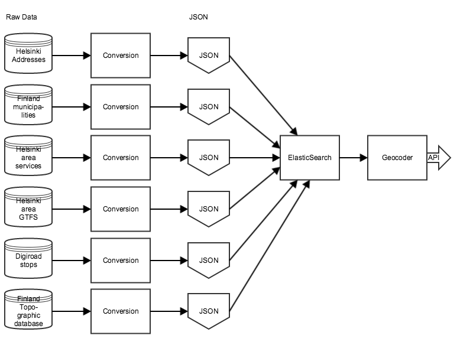

Geocoder fetches data from multiple sources, converts them into JSON and loads data into ElasticSearch database. Our Geocoder API is a simple REST wrapper on ElasticSearch data.

Geocoder API docs:
http://digitransit.fi/geocoder/

Geocoding data flow can be studied more closely here:
https://github.com/HSLdevcom/digitransit-geocoder/blob/master/scripts/import-data.sh

Different conversions can be studied more closely here:
https://github.com/HSLdevcom/digitransit-geocoder/tree/master/geocoder

Geocoder API implementation:
https://github.com/HSLdevcom/digitransit-geocoder/blob/master/geocoder/app.py
