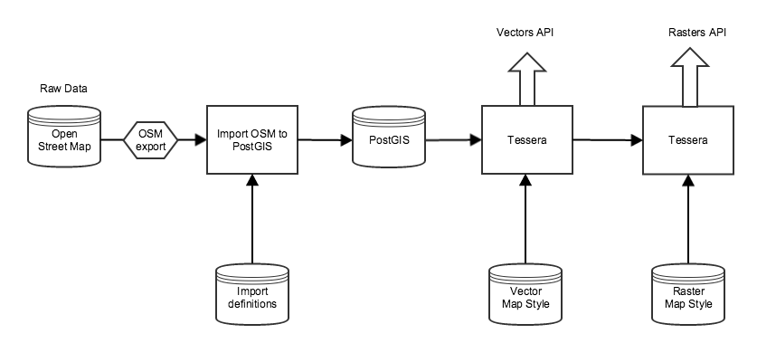

Map tile services provide Open Street Map data in two different format:

1. Styled Raster tiles
2. Styles Vector tiles

First, OSM data is loaded into Postgis in vector format. Then two different Tessera map servers are used to serve that data as tiles.

Postgis import is done using these files:
https://github.com/HSLdevcom/digitransit-deploy/tree/master/roles/postgis-osm-docker-image/templates

Vector map server is a Tessera map server started as Docker container. See Dockerfile:
https://github.com/HSLdevcom/digitransit-deploy/blob/master/roles/vector-map-server-docker-image/templates/Dockerfile.j2

Raster map server runs also on Tessera. See Dockerfile for it:
https://github.com/HSLdevcom/digitransit-deploy/blob/master/roles/map-server-docker-image/templates/Dockerfile.j2

Vector map style can be seen here:
https://github.com/HSLdevcom/osm-bright.tm2source

Raster map style (Mapbox studio project):
https://github.com/HSLdevcom/digitransit-map
