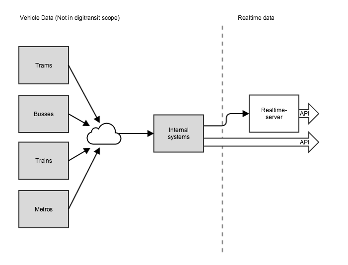

## Dataflow

Heavy lifting of realtime data is done in other systems. Digitransit user interface integrates to MQTT datasources in order to read realtime data from vehicles. In Helsinki city region realtime service, vehicle data is sent once every 30 seconds. Our realtime server works as a cache for MQTT datasource thus enabling user interface to query "old" realtime information and show that data immediately to user.

You might notice that currently the name of realtime server is "Navigator-server". Realtime functionality will be changing in near future and implementation details are not yet clear. Navigator-server is a proof of concept that was developed by HSL earlier.

Read more about MQTT:
http://mqtt.org/

See Realtime-server code:
https://github.com/HSLdevcom/navigator-server
