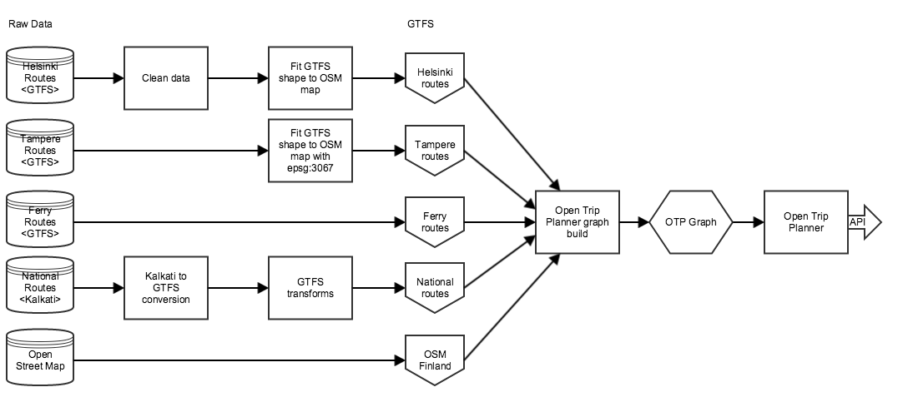

## Dataflow

Route data is built of the whole Finland area. First, we download raw data in various formats from Helsinki, Tampere, Oulu, etc. and this data is stored on disk. Also, we load Finnish national data from Finnish Transport Agency that contains national routes for e.g. trains. Some data is cleaned, some isn’t.

For Helsinki and Tampere data we apply GTFS shape to OSM map transformation. The purpose of this step is to better allign routes on OSM map. In different map datasources road locations can slightly vary and this step allows us to better draw routes on OSM map. Conversion is currently done using this tool: https://github.com/hannesj/gtfs_shape_mapfit.git

Finnish national data is in Kalkati-format. Our goal is to get every data into GTFS so Kalkati-to-GTFS transformation is applied using this tool: https://github.com/HSLdevcom/kalkati2gtfs

After conversion some GTFS transformations are done using OneBusAway transformer (http://developer.onebusaway.org/modules/onebusaway-gtfs-modules/1.3.4-SNAPSHOT/onebusaway-gtfs-transformer-cli.html)

Route data flow can be studied more closely here: https://github.com/HSLdevcom/digitransit-deploy/blob/master/roles/route-server-docker-image/templates/build-routes.sh.j2

Environment dependencies can be studied more closely here: https://github.com/HSLdevcom/digitransit-deploy/blob/master/roles/route-server-docker-image/templates/install-dependencies.sh.j2

## Key service delivery activities
1. Keep up with OpenStreetMap blog
> https://blog.openstreetmap.org/
2. Keep up with gtfs_shape_mapfit upstream
> https://github.com/tru-hy/gtfs_shape_mapfit
