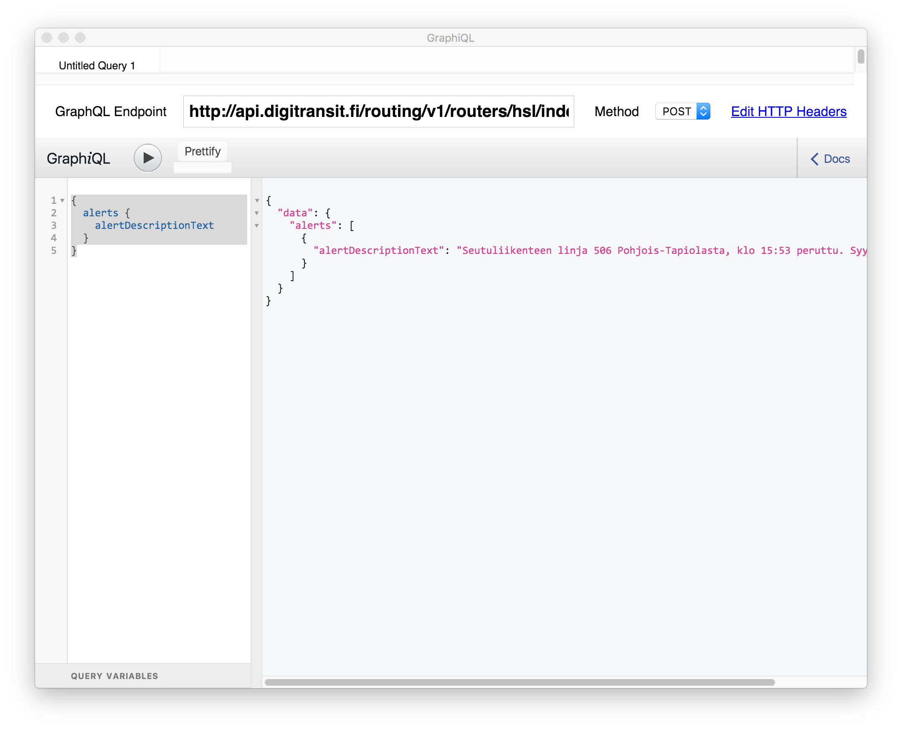

## Making queries and exploring schema using GraphiQL

**It is highly recommended to use GraphiQL.**

[GraphiQL](https://github.com/graphql/graphiql) is a simple UI for making queries. You can use it both to run queries and to explore the GraphQL schema.

**Note:** All top level queries should have at least some description available and you can use documentation explorer to familiarize yourself with the schema. You can find more details about that under [Reading schema docs](#reading-schema-docs).

### There are a few options for using GraphiQL:

1) A browser extension like ChromeiQL (https://chrome.google.com/webstore/detail/chromeiql/fkkiamalmpiidkljmicmjfbieiclmeij)
2) Using browser versions for the three regions available:

**Helsinki region:**
> https://api.digitransit.fi/graphiql/hsl

**Waltti regions:**
> https://api.digitransit.fi/graphiql/waltti

**Finland version:**
> https://api.digitransit.fi/graphiql/finland

The browser versions have the correct endpoint configured already.

3) For Mac OSX you can use desktop version: [GraphiQL app](https://github.com/skevy/graphiql-app)

All options work similarly and UI looks more or less like this (ChromeiQL extension has been used in the example below):


## Execute your first query

1. If you are using GraphiQL app or browser extension, set "GraphQL Endpoint" to one of the following:
- Helsinki region: http://<i></i>api.digitransit.fi/routing/v1/routers/hsl/index/graphql
- Waltti regions: http://<i></i>api.digitransit.fi/routing/v1/routers/waltti/index/graphql
- Finland: http://<i></i>api.digitransit.fi/routing/v1/routers/finland/index/graphql

2. Click [this link](https://api.digitransit.fi/graphiql/hsl?query=%7B%0A%20%20stop(id%3A%20%22HSL%3A1040129%22)%20%7B%0A%20%20%20%20name%0A%20%20%20%20lat%0A%20%20%20%20lon%0A%20%20%20%20wheelchairBoarding%0A%20%20%7D%0A%7D) to run the query below in GraphiQL.

```
{
  stop(id: "HSL:1040129") {
    name
    lat
    lon
    wheelchairBoarding
  }
}
```

3. Press play in GraphiQL to execute the query.

4. You should get results like below:

```
{
  "data": {
    "stop": {
      "name": "Arkadian puisto",
      "lat": 60.17112,
      "lon": 24.93338,
      "wheelchairBoarding": "NOT_POSSIBLE"
    }
  }
}
```
**Note:** If the example provided does not return what is expected then the id used in step 2 may not be in use any more and you should just try to use some other id.

## Exploring schema with GraphiQL

GraphiQL is schema aware. This means that you can invoke autocomplete by Ctrl-space. Tool then shows available options for query.


## Reading schema docs

By clicking **"< docs"** on the upper right corner in GraphiQL, you can open **Documentation Explorer**. Click on **"query: QueryType"** there will open all top level queries available.


From here you can check e.g. "alerts", which describes what can be queried using that top level. It says "Get all alerts active in the graph".


Let's try to query alerts:

1. Close docs

2. Click [this link](https://api.digitransit.fi/graphiql/hsl?query=%7B%0A%20%20alerts%20%7B%0A%20%20%20%20alertDescriptionText%0A%20%20%7D%0A%7D) to run the query below in GraphiQL.
 
```
{
  alerts {
    alertDescriptionText
  }
}
```

3. Press play in GraphiQL to execute the query

Depending on current situation you might get some disruption info


