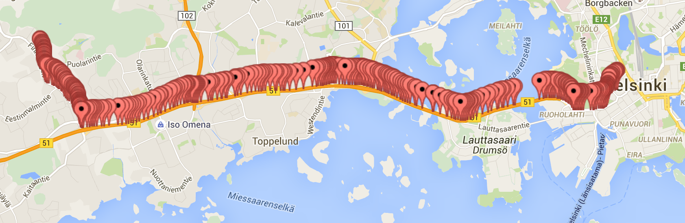

**If you are not yet familiar with [GraphQL](../0-graphql) and [GraphiQL](../1-graphiql) it is highly recommended to review those pages at first.**

## Glossary

| Term                   | Explanation                     |
|------------------------|---------------------------------|
| Itinerary              | A combination of different transportation modes at certain times to reach from origin to destination. For example, walking to a bus stop, taking a bus for two stops and then walking to the final destination.<br/>Commonly used synonym: journey |
| Leg                    | One part of an itinerary, e.g. walking to a bus stop or a bus ride between two stops. |
| Origin                 | A geographical point where an itinerary begins. |
| Destination            | A geographical point where an itinerary ends. |

### Note about Itinerary leg geometries

You can ask the server to return geometries for itineraries. The API will return them in [Google polyline-encoded format](https://developers.google.com/maps/documentation/utilities/polylinealgorithm). It looks like this:
```
"legGeometry": {
  "length": 349,
  "points": "wwfnJyjdwCXlAHLNfAFHDZz@nEh@hBXfA\\hAR^VLnChAD@HDHDjBt@^N|@`@JDHNFB`@RHDJFD@PD^fBDNNp@@JBPHl@FdA@d@@TFrCDnATpEL~CBnA@pADpELbQ?pB?nBC~@DdC?R?LDtC?P?j@@XG~@Ef@CPCHGHoAtAQT_@f@w@rAc@~@g@lAi@fBc@hBWvASzAWrBUtBQxBOtBMhCOvEEhCCfC@vB@fBDrCFlCJnCb@xIfFl_APdDr@dMd@bIV~D\\bFPnCjAtMt@~GxAhMlBfOz@jHVjCR~BNpCHrBFjCDdC?`CC`DIfDSxDUhDe@fFu@tHMzA{AlOcBtPCXE`@sCrY_BbPShCeAxJc@pDg@nECJi@~Di@dDUbAkA~Gk@bD_@vBUbB]lBe@lDY~B[rCWbC_@~DYfDW|BQ~Am@tGOfBOxAWlCKzAMvAIbAMpBIpAAd@GhACp@EhAEtAA~ACfCAnC@fA?rAClDC`G@`BCxHKlCMhIK~FE|CA~@@|@BxB@^?@DtAHbBLzALjBHbBFlAF|ADxAD|BNrEPjCTtHdAhVp@jSVlPFjJ?dC?hE?dJ?xC?vLDfKDpEF|CFnDPjHZvH\\xH|@jQXnF\\nFBXdAtSJtCZrG@^b@`K^dJLnDLtDj@bRT`IAb@?~@?dA@~A?fA?|@AjAE~BA`BBdABd@Bh@HfARnBPpBl@zFt@lGr@vE\\|Cz@dHrA|JdAtHPpAl@dEjA~I~AvNv@tIx@vKTtD`@nHTrENtDRzEPvHR|J\\`VNdKAjEFpLBlFDjCBfCFxBNjE`@nH@j@An@Cr@I^O^y@l@iAt@S@IAIGMKCICIKIKEI?MDILKVQVW^WVUPSJuAT??_ANaALg@No@ZkAz@a@ZKR]j@a@h@i@fA[f@Q`@u@dCmAvEw@dCk@nAe@z@S\\iAnAeA`Ai@f@eAfBy@rBu@rCMf@WfAU`Ac@`Bi@`CKh@ANUdBq@~GW|BQdAK^M\\IROVMLs@d@q@\\]P}@R{@BaA@_@Iu@E]?CAU?M?W@i@DKBg@NUDq@V}@^g@XQJk@h@EDQPeBnBIHILU\\"
}
```

You can use the [polyline npm module](https://www.npmjs.com/package/polyline) to get some idea what this data looks like:

``` javascript
var polyline = require('polyline')
var line = polyline.decode("wwfnJyjdwCXlAHLNfAFHDZz@nEh@hBXfA\\hAR^VLnChAD@HDHDjBt@^N|@`@JDHNFB`@RHDJFD@PD^fBDNNp@@JBPHl@FdA@d@@TFrCDnATpEL~CBnA@pADpELbQ?pB?nBC~@DdC?R?LDtC?P?j@@XG~@Ef@CPCHGHoAtAQT_@f@w@rAc@~@g@lAi@fBc@hBWvASzAWrBUtBQxBOtBMhCOvEEhCCfC@vB@fBDrCFlCJnCb@xIfFl_APdDr@dMd@bIV~D\\bFPnCjAtMt@~GxAhMlBfOz@jHVjCR~BNpCHrBFjCDdC?`CC`DIfDSxDUhDe@fFu@tHMzA{AlOcBtPCXE`@sCrY_BbPShCeAxJc@pDg@nECJi@~Di@dDUbAkA~Gk@bD_@vBUbB]lBe@lDY~B[rCWbC_@~DYfDW|BQ~Am@tGOfBOxAWlCKzAMvAIbAMpBIpAAd@GhACp@EhAEtAA~ACfCAnC@fA?rAClDC`G@`BCxHKlCMhIK~FE|CA~@@|@BxB@^?@DtAHbBLzALjBHbBFlAF|ADxAD|BNrEPjCTtHdAhVp@jSVlPFjJ?dC?hE?dJ?xC?vLDfKDpEF|CFnDPjHZvH\\xH|@jQXnF\\nFBXdAtSJtCZrG@^b@`K^dJLnDLtDj@bRT`IAb@?~@?dA@~A?fA?|@AjAE~BA`BBdABd@Bh@HfARnBPpBl@zFt@lGr@vE\\|Cz@dHrA|JdAtHPpAl@dEjA~I~AvNv@tIx@vKTtD`@nHTrENtDRzEPvHR|J\\`VNdKAjEFpLBlFDjCBfCFxBNjE`@nH@j@An@Cr@I^O^y@l@iAt@S@IAIGMKCICIKIKEI?MDILKVQVW^WVUPSJuAT??_ANaALg@No@ZkAz@a@ZKR]j@a@h@i@fA[f@Q`@u@dCmAvEw@dCk@nAe@z@S\\iAnAeA`Ai@f@eAfBy@rBu@rCMf@WfAU`Ac@`Bi@`CKh@ANUdBq@~GW|BQdAK^M\\IROVMLs@d@q@\\]P}@R{@BaA@_@Iu@E]?CAU?M?W@i@DKBg@NUDq@V}@^g@XQJk@h@EDQPeBnBIHILU\\")
for (var i=0; i < line.length; i++) {
  var s = line[i][0] + ", " + line[i][1]
  console.log(s)
}
```
By running this on Node.js, it prints a table like so:
```
...
60.17545, 24.68756
60.1755, 24.68751
60.17555, 24.68744
60.17566, 24.68729
```

You can copy paste this into a tool that [plots points on map](http://www.darrinward.com/lat-long/?id=1974554).



## Query examples

**Note:** For more details about the query type **plan** and its parameters you can use the **Documentation Explorer** provided in GraphiQL.

Itinerary planning can be tuned by multiple arguments of the **plan** query.
* Time arguments (e.g. `minTransferTime`, `bikeSwitchTime`) are taken into account literally when planning the itinerary
  * For example, if `minTransferTime` is set to 2 minutes, it is not possible to continue the journey by another vehicle within two minutes after disembarking one vehicle
* Cost arguments (e.g. `walkBoardCost`) on the other hand are not hard limits, but preferences 
  * For example, if `walkBoardCost` is set to 2 minutes, it is possible to continue the journey immediately after disembarking from one vehicle, but up to 2 minutes longer itineraries are preferred if they have one transfer less and up to 4 minutes longer itineraries are preferred if they have two transfers less, etc.
  * Cost is not included in the returned duration of an itinerary
* Weight arguments (e.g. `walkReluctance`) are used to multiply costs of an leg
  * For example, if `walkReluctance` is set to 3.0, the cost of each walking section will be multiplied by 3

### Plan an itinerary from location (60.168992,24.932366) to (60.175294,24.684855)

1. Click [this link](https://api.digitransit.fi/graphiql/hsl?query=%7B%0A%20%20plan(%0A%20%20%20%20from%3A%20%7Blat%3A%2060.168992%2C%20lon%3A%2024.932366%7D%0A%20%20%20%20to%3A%20%7Blat%3A%2060.175294%2C%20lon%3A%2024.684855%7D%0A%20%20%20%20numItineraries%3A%203%0A%20%20)%20%7B%0A%20%20%20%20itineraries%20%7B%0A%20%20%20%20%20%20legs%20%7B%0A%20%20%20%20%20%20%20%20startTime%0A%20%20%20%20%20%20%20%20endTime%0A%20%20%20%20%20%20%20%20mode%0A%20%20%20%20%20%20%20%20duration%0A%20%20%20%20%20%20%20%20realTime%0A%20%20%20%20%20%20%20%20distance%0A%20%20%20%20%20%20%20%20transitLeg%0A%20%20%20%20%20%20%7D%0A%20%20%20%20%7D%0A%20%20%7D%0A%7D) to run the query below in GraphiQL.

```
{
  plan(
    from: {lat: 60.168992, lon: 24.932366}
    to: {lat: 60.175294, lon: 24.684855}
    numItineraries: 3
  ) {
    itineraries {
      legs {
        startTime
        endTime
        mode
        duration
        realTime
        distance
        transitLeg
      }
    }
  }
}
```

2. Press play in GraphiQL to execute the query.

### Basic route from Kamppi (Helsinki) to Pisa (Espoo)

* Origin and destination locations can be named by using arguments `fromPlace` and `toPlace` instead of `to` and `from`
  * Values for arguments `fromPlace` and `toPlace` are in format `<name>::<lat>,<lng>`  

1. Click [this link](https://api.digitransit.fi/graphiql/hsl?query=%7B%0A%20%20plan(%0A%20%20%20%20fromPlace%3A%20%22Kamppi%2C%20Helsinki%3A%3A60.168992%2C24.932366%22%2C%0A%20%20%20%20toPlace%3A%20%22Pisa%2C%20Espoo%3A%3A60.175294%2C24.684855%22%2C%0A%20%20)%20%7B%0A%20%20%20%20itineraries%7B%0A%20%20%20%20%20%20walkDistance%2C%0A%20%20%20%20%20%20duration%2C%0A%20%20%20%20%20%20legs%20%7B%0A%20%20%20%20%20%20%20%20mode%0A%20%20%20%20%20%20%20%20startTime%0A%20%20%20%20%20%20%20%20endTime%0A%20%20%20%20%20%20%20%20from%20%7B%0A%20%20%20%20%20%20%20%20%20%20lat%0A%20%20%20%20%20%20%20%20%20%20lon%0A%20%20%20%20%20%20%20%20%20%20name%0A%20%20%20%20%20%20%20%20%20%20stop%20%7B%0A%20%20%20%20%20%20%20%20%20%20%20%20code%0A%20%20%20%20%20%20%20%20%20%20%20%20name%0A%20%20%20%20%20%20%20%20%20%20%7D%0A%20%20%20%20%20%20%20%20%7D%2C%0A%20%20%20%20%20%20%20%20to%20%7B%0A%20%20%20%20%20%20%20%20%20%20lat%0A%20%20%20%20%20%20%20%20%20%20lon%0A%20%20%20%20%20%20%20%20%20%20name%0A%20%20%20%20%20%20%20%20%7D%2C%0A%20%20%20%20%20%20%20%20agency%20%7B%0A%20%20%20%20%20%20%20%20%20%20gtfsId%0A%09%20%20%09%09%09name%0A%20%20%20%20%20%20%20%20%7D%2C%0A%20%20%20%20%20%20%20%20distance%0A%20%20%20%20%20%20%20%20legGeometry%20%7B%0A%20%20%20%20%20%20%20%20%20%20length%0A%20%20%20%20%20%20%20%20%20%20points%0A%20%20%20%20%20%20%20%20%7D%0A%20%20%20%20%20%20%7D%0A%20%20%20%20%7D%0A%20%20%7D%0A%7D) to run the query below in GraphiQL.

```
{
  plan(
    fromPlace: "Kamppi, Helsinki::60.168992,24.932366",
    toPlace: "Pisa, Espoo::60.175294,24.684855",
  ) {
    itineraries{
      walkDistance,
      duration,
      legs {
        mode
        startTime
        endTime
        from {
          lat
          lon
          name
          stop {
            code
            name
          }
        },
        to {
          lat
          lon
          name
        },
        agency {
          gtfsId
	  name
        },
        distance
        legGeometry {
          length
          points
        }
      }
    }
  }
}
```

2. Press play in GraphiQL to execute the query.

### Plan an itinerary using only WALK and RAIL modes

1. Click [this link](https://api.digitransit.fi/graphiql/hsl?query=%0A%7B%0A%20%20plan(%0A%20%20%20%20from%3A%20%7Blat%3A%2060.199196699999995%2C%20lon%3A%2024.9397302%7D%0A%20%20%20%20to%3A%20%7Blat%3A%2060.168438%2C%20lon%3A%2024.929283%7D%0A%20%20%20%20numItineraries%3A%203%0A%20%20%09transportModes%3A%20%5B%7Bmode%3A%20WALK%7D%2C%20%7Bmode%3A%20RAIL%7D%5D%0A%20%20)%20%7B%0A%20%20%20%20itineraries%20%7B%0A%20%20%20%20%20%20legs%20%7B%0A%20%20%20%20%20%20%20%20startTime%0A%20%20%20%20%20%20%20%20endTime%0A%20%20%20%20%20%20%20%20mode%0A%20%20%20%20%20%20%20%20duration%0A%20%20%20%20%20%20%20%20realTime%0A%20%20%20%20%20%20%20%20distance%0A%20%20%20%20%20%20%20%20transitLeg%0A%20%20%20%20%20%20%7D%0A%20%20%20%20%7D%0A%20%20%7D%0A%7D) to run the query below in GraphiQL.

```
{
  plan(
    from: {lat: 60.199196699999995, lon: 24.9397302}
    to: {lat: 60.168438, lon: 24.929283}
    numItineraries: 3
    transportModes: [{mode: WALK}, {mode: RAIL}]
  ) {
    itineraries {
      legs {
        startTime
        endTime
        mode
        duration
        realTime
        distance
        transitLeg
      }
    }
  }
}
```

2. Press play in GraphiQL to execute the query.

### Plan an itinerary from Hakaniemi to Keilaniemi and modify the following parameters:

* Return five results: (`numItineraries: 5`)
* Use transportation modes other than subway (`transportModes`)
* Walking speed of 1,7m/s (`walkSpeed: 1.7`)
* Use a 10 minute safety margin for transfers (`minTransferTime: 600`)
* Use a 5 minute boarding cost (`walkBoardCost: 300`)
  * Boarding cost is used to prefer itineraries with less vehicle boardings
    * For example, if `walkBoardCost: 300` is used and there is a 48min itinerary with one boarding and a 45min itinerary with two boardings, the 48 minute itinerary is returned, because its total cost is smaller (48min + 5min vs. 45min + 5min + 5min)
* Use multiplier of 2.1 for walk reluctance to prefer routes with less walking (`walkReluctance: 2.1`)
  * Walking times are multiplied with this multiplier
* Specific departure date and time
  * `date` in format YYYY-MM-DD
  * `time` in format hh:mm:ss

1. Click [this link](https://api.digitransit.fi/graphiql/hsl?query=%7B%0A%20%20plan(%0A%20%20%20%20fromPlace%3A%20%22Hakaniemi%2C%20Helsinki%3A%3A60.179267%2C24.951501%22%2C%0A%20%20%20%20toPlace%3A%20%22Keilaniemi%2C%20Espoo%3A%3A60.1762%2C24.836584%22%2C%0A%20%20%20%20date%3A%20%222018-08-21%22%2C%0A%20%20%20%20time%3A%20%2223%3A28%3A00%22%2C%0A%20%20%20%20numItineraries%3A%205%2C%0A%20%20%20%20transportModes%3A%20%5B%7Bmode%3A%20BUS%7D%2C%20%7Bmode%3A%20RAIL%7D%2C%20%7Bmode%3ATRAM%7D%2C%20%7Bmode%3A%20FERRY%7D%2C%20%7Bmode%3AWALK%7D%5D%0A%20%20%20%20walkReluctance%3A%202.1%2C%0A%20%20%20%20walkBoardCost%3A%20300%2C%0A%20%20%20%20minTransferTime%3A%20600%2C%0A%20%20%20%20walkSpeed%3A%201.7%2C%0A%20%20)%20%7B%0A%20%20%20%20itineraries%7B%0A%20%20%20%20%20%20walkDistance%0A%20%20%20%20%20%20duration%0A%20%20%20%20%20%20legs%20%7B%0A%20%20%20%20%20%20%20%20mode%0A%20%20%20%20%20%20%20%20startTime%0A%20%20%20%20%20%20%20%20endTime%0A%20%20%20%20%20%20%20%20from%20%7B%0A%20%20%20%20%20%20%20%20%20%20lat%0A%20%20%20%20%20%20%20%20%20%20lon%0A%20%20%20%20%20%20%20%20%20%20name%0A%20%20%20%20%20%20%20%20%20%20stop%20%7B%0A%20%20%20%20%20%20%20%20%20%20%20%20code%0A%20%20%20%20%20%20%20%20%20%20%20%20name%0A%20%20%20%20%20%20%20%20%20%20%7D%0A%20%20%20%20%20%20%20%20%7D%0A%20%20%20%20%20%20%20%20to%20%7B%0A%20%20%20%20%20%20%20%20%20%20lat%0A%20%20%20%20%20%20%20%20%20%20lon%0A%20%20%20%20%20%20%20%20%20%20name%0A%20%20%20%20%20%20%20%20%20%20stop%20%7B%0A%20%20%20%20%20%20%20%20%20%20%20%20code%0A%20%20%20%20%20%20%20%20%20%20%20%20name%0A%20%20%20%20%20%20%20%20%20%20%7D%0A%20%20%20%20%20%20%20%20%7D%0A%20%20%20%20%20%20%20%20trip%20%7B%0A%20%20%20%20%20%20%20%20%09tripHeadsign%0A%20%20%20%20%20%20%20%20%20%20routeShortName%0A%20%20%20%20%20%20%20%20%7D%0A%20%20%20%20%20%20%20%20distance%0A%20%20%20%20%20%20%20%20legGeometry%20%7B%0A%20%20%20%20%20%20%20%20%20%20length%0A%20%20%20%20%20%20%20%20%20%20points%0A%20%20%20%20%20%20%20%20%7D%0A%20%20%20%20%20%20%7D%0A%20%20%20%20%7D%0A%20%20%7D%0A%7D) to run the query below in GraphiQL.

```{
  plan(
    fromPlace: "Hakaniemi, Helsinki::60.179267,24.951501",
    toPlace: "Keilaniemi, Espoo::60.1762,24.836584",
    date: "2018-08-21",
    time: "23:28:00",
    numItineraries: 5,
    transportModes: [{mode: BUS}, {mode: RAIL}, {mode:TRAM}, {mode: FERRY}, {mode:WALK}]
    walkReluctance: 2.1,
    walkBoardCost: 300,
    minTransferTime: 600,
    walkSpeed: 1.7,
  ) {
    itineraries{
      walkDistance
      duration
      legs {
        mode
        startTime
        endTime
        from {
          lat
          lon
          name
          stop {
            code
            name
          }
        }
        to {
          lat
          lon
          name
          stop {
            code
            name
          }
        }
        trip {
          tripHeadsign
          routeShortName
        }
        distance
        legGeometry {
          length
          points
        }
      }
    }
  }
}
```

2. Change arguments `date` and `time`.
3. Press play in GraphiQL to execute the query.

### Plan an itinerary using Park & Ride

* Using qualifier **PARK** for **CAR** mode plans an itinerary using Park & Ride, i.e. the first leg of the journey is done by driving to a car park and continuing by public transportation from there

1. Click [this link](https://api.digitransit.fi/graphiql/hsl?query=%7B%0A%20%20plan(%0A%20%20%20%20fromPlace%3A%20%22Seutula%3A%3A60.34770%2C24.86569%22%2C%0A%20%20%20%20toPlace%3A%20%22Kamppi%3A%3A60.16870%2C24.93129%22%2C%0A%20%20%20%20transportModes%3A%20%5B%7Bmode%3A%20CAR%2C%20qualifier%3A%20PARK%7D%2C%20%7Bmode%3A%20TRANSIT%7D%2C%20%7Bmode%3AWALK%7D%5D%0A%20%20)%20%7B%0A%20%20%20%20itineraries%7B%0A%20%20%20%20%20%20walkDistance%0A%20%20%20%20%20%20duration%0A%20%20%20%20%20%20legs%20%7B%0A%20%20%20%20%20%20%20%20mode%0A%20%20%20%20%20%20%20%20startTime%0A%20%20%20%20%20%20%20%20endTime%0A%20%20%20%20%20%20%20%20duration%0A%20%20%20%20%20%20%20%20from%20%7B%0A%20%20%20%20%20%20%20%20%20%20lat%0A%20%20%20%20%20%20%20%20%20%20lon%0A%20%20%20%20%20%20%20%20%20%20name%0A%20%20%20%20%20%20%20%20%20%20stop%20%7B%0A%20%20%20%20%20%20%20%20%20%20%20%20code%0A%20%20%20%20%20%20%20%20%20%20%20%20name%0A%20%20%20%20%20%20%20%20%20%20%7D%0A%20%20%20%20%20%20%20%20%7D%0A%20%20%20%20%20%20%20%20to%20%7B%0A%20%20%20%20%20%20%20%20%20%20lat%0A%20%20%20%20%20%20%20%20%20%20lon%0A%20%20%20%20%20%20%20%20%20%20name%0A%20%20%20%20%20%20%20%20%20%20stop%20%7B%0A%20%20%20%20%20%20%20%20%20%20%20%20code%0A%20%20%20%20%20%20%20%20%20%20%20%20name%0A%20%20%20%20%20%20%20%20%20%20%7D%0A%20%20%20%20%20%20%20%20%20%20carPark%20%7B%0A%20%20%20%20%20%20%20%20%20%20%20%20carParkId%0A%20%20%20%20%20%20%20%20%20%20%20%20name%0A%20%20%20%20%20%20%20%20%20%20%7D%0A%20%20%20%20%20%20%20%20%7D%0A%20%20%20%20%20%20%20%20trip%20%7B%0A%20%20%20%20%20%20%20%20%09tripHeadsign%0A%20%20%20%20%20%20%20%20%20%20routeShortName%0A%20%20%20%20%20%20%20%20%7D%0A%20%20%20%20%20%20%20%20distance%0A%20%20%20%20%20%20%20%20legGeometry%20%7B%0A%20%20%20%20%20%20%20%20%20%20length%0A%20%20%20%20%20%20%20%20%20%20points%0A%20%20%20%20%20%20%20%20%7D%0A%20%20%20%20%20%20%7D%0A%20%20%20%20%7D%0A%20%20%7D%0A%7D) to run the query below in GraphiQL.

```
{
  plan(
    fromPlace: "Seutula::60.34770,24.86569",
    toPlace: "Kamppi::60.16870,24.93129",
    transportModes: [{mode: CAR, qualifier: PARK}, {mode: TRANSIT}, {mode:WALK}]
  ) {
    itineraries{
      walkDistance
      duration
      legs {
        mode
        startTime
        endTime
        duration
        from {
          lat
          lon
          name
          stop {
            code
            name
          }
        }
        to {
          lat
          lon
          name
          stop {
            code
            name
          }
          carPark {
            carParkId
            name
          }
        }
        trip {
          tripHeadsign
          routeShortName
        }
        distance
        legGeometry {
          length
          points
        }
      }
    }
  }
}
```

2. Press play in GraphiQL to execute the query.

### Plan an itinerary and query fare information

* **Note:** Currently only regular adult fare information is available

1. Click [this link](https://api.digitransit.fi/graphiql/hsl?query=%7B%0A%20%20plan(%0A%20%20%20%20from%3A%20%7Blat%3A%2060.1713572%2C%20lon%3A%2024.9416544%7D%0A%20%20%20%20to%3A%20%7Blat%3A%2060.40431%2C%20lon%3A%2025.1066186%7D%0A%20%20%20%20numItineraries%3A%203%0A%20%20)%20%7B%0A%20%20%20%20date%0A%20%20%20%20itineraries%20%7B%0A%20%20%20%20%20%20legs%20%7B%0A%20%20%20%20%20%20%20%20startTime%0A%20%20%20%20%20%20%20%20endTime%0A%20%20%20%20%20%20%20%20mode%0A%20%20%20%20%20%20%20%20duration%0A%20%20%20%20%20%20%20%20realTime%0A%20%20%20%20%20%20%20%20distance%0A%20%20%20%20%20%20%20%20transitLeg%0A%20%20%20%20%20%20%7D%0A%20%20%20%20%20%20fares%20%7B%0A%20%20%20%20%20%20%20%20type%0A%20%20%20%20%20%20%20%20cents%0A%20%20%20%20%20%20%20%20currency%0A%20%20%20%20%20%20%7D%0A%20%20%20%20%7D%0A%20%20%7D%0A%7D) to run the query below in GraphiQL.

```
{
  plan(
    from: {lat: 60.1713572, lon: 24.9416544}
    to: {lat: 60.40431, lon: 25.1066186}
    numItineraries: 3
  ) {
    date
    itineraries {
      legs {
        startTime
        endTime
        mode
        duration
        realTime
        distance
        transitLeg
      }
      fares {
        type
        cents
        currency
      }
    }
  }
}
```

2. Press play in GraphiQL to execute the query.
