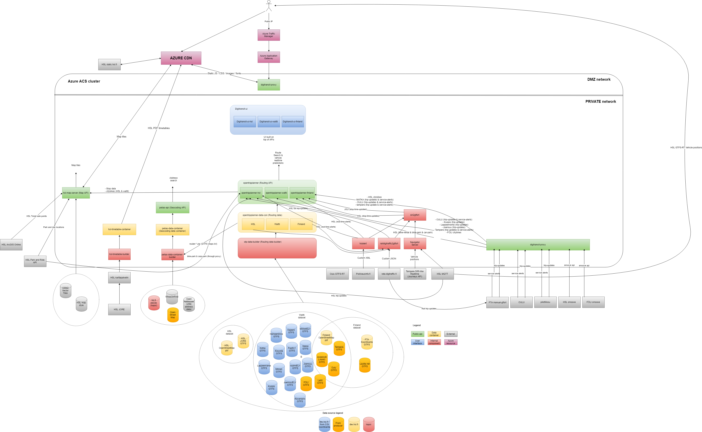

Digitransit architecture is based on microservices architecture. Microservices are small, autonomous services that work together that allow us to build larger applications on top of APIs that the services provide.

Digitransit has three types of services:

1. Data services
2. API services
3. UI services

## Data services
Data services download, concatenate, transform, and compile data from multiple datasource into a datastore. Datastore can conceptually be anything: Database, graphfile, etc.

Purpose of data services is to provide data for api services. Examples of data services are geocoding-data and routing-data.

## API Service components
API services provide interfaces into data provided by data-services. Basically, these are REST, GraphQL, and other interfaces that provide routing, geocoding and other services.

## UI services
User interface services are UIs that we provide that work on top of API services.
