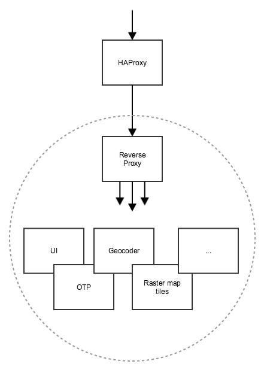

Digitransit platform components need to be weaved together to form a runtime that can be used for multimodal routing.
Each component is first built into a Docker image and then started as a Docker container.

Since logical entities (e.g. Map and Routing) consist of multiple containers, we need a way to weave these containers together while enabling load balancing for each of the services.

At the moment we use [OpenShift](https://www.openshift.com/) PaaS to run the enviroment. It works more or less like this:

OpenShift deployment scripts are available at https://github.com/HSLdevcom/digitransit-openshift-deploy
