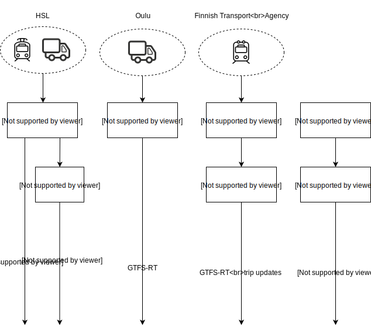

## About the API
Heavy lifting of real-time data is done in other systems. Digitransit integrates itself to various datasources in order to read real-time data from the vehicles. How this is done depends on which region we are talking about.

