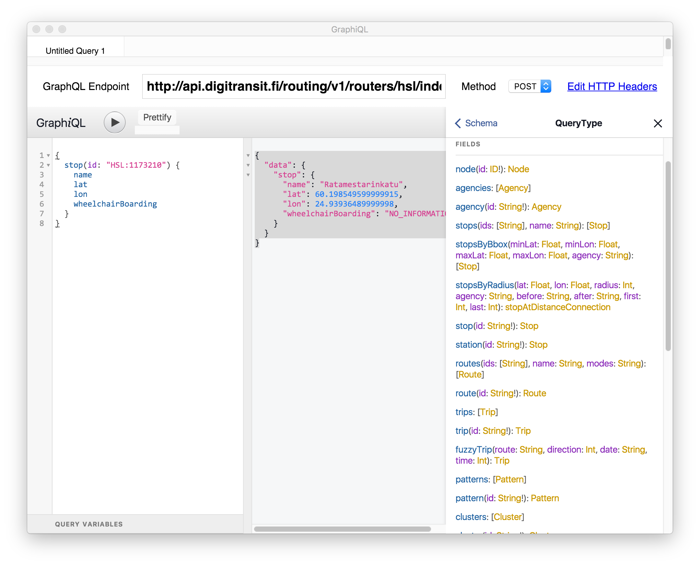
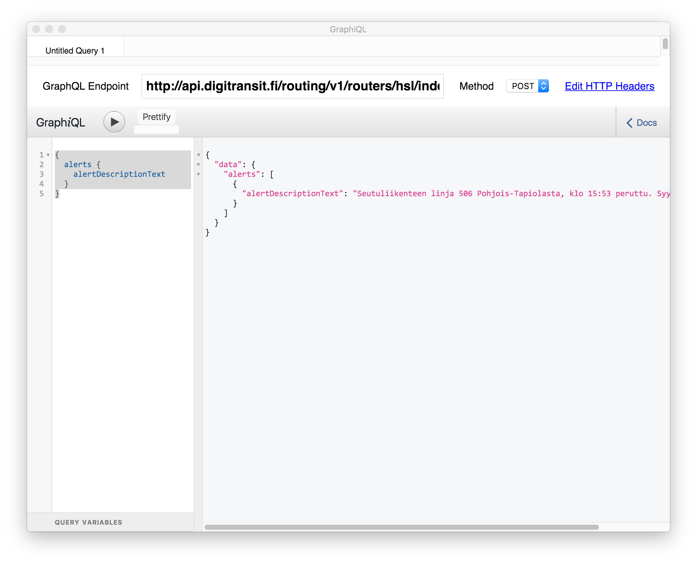

Routing queries can be made to GraphQL api.

# What is GraphQL?

[GraphQL](http://graphql.org/) is a standard created by Facebook. Basically, you can think it like "client side SQL". When implementing a GraphQL API, server developers defines a GraphQL schema that defines what can be queried. Instead of client calling REST-like urls, it generates different GraphQL queries and send these queries to API. Server parses the query, executes it, and returns results in JSON format.

## GraphQL benefits

There are many. You can read [how Facebook sees it](https://facebook.github.io/relay/docs/thinking-in-graphql.html).

# GraphQL API

Helsinki area API is available at:
> https://api.digitransit.fi/routing/v1/routers/hsl/index/graphql

Whole finland API is available at:
> https://api.digitransit.fi/routing/v1/routers/finland/index/graphql

### API requirements

API requires that
- HTTP method must be POST
- Content-Type: application/json header is present  

## cURL examples

Examples below send a GraphQL query as HTTP post to api.digitransit.fi. This query asks server to find stop using id "HSL:11773210" and return its name, latitude and longitude coordinates, and whether is is accessible by wheelchair.

### Windows

TODO

### Linux & OSX

```
curl https://api.digitransit.fi/routing/v1/routers/hsl/index/graphql \
-H 'Content-Type: application/json' \
-d @- << DATA
{
  "query": "{
    stop(id: \"HSL:1173210\") {
      name
      lat
      lon
      wheelchairBoarding
    }
  }"
}
DATA
```

Some description to cURL parameters:
- -H 'Content-Type: application/json' defines correct Content-Type header
- -d @- tells cURL to read post data from STDIN
- << DATA defines [here documents code block](http://www.tldp.org/LDP/abs/html/here-docs.html)

### Making queries and exploring schema using GraphiQL

[GraphiQL](https://github.com/skevy/graphiql-app) is a tool for making GraphiQL queries. You can use it to make queries but also for exploring GraphQL schema. It is highly recommended to use it.


#### Install and execute first query

1. [Download GraphiQL](https://github.com/skevy/graphiql-app)

2. set "GraphQL Endpoint" to
- Helsinki area: "http://api.digitransit.fi/routing/v1/routers/hsl/index/graphql"
- Finland: "http://api.digitransit.fi/routing/v1/routers/finland/index/graphql"

3. Copy this as query:

```
{
  stop(id: "HSL:1173210") {
    name
    lat
    lon
    wheelchairBoarding
  }
}
```

4. Press play to execute query

#### Exploring schema

GraphiQL is schema aware. This means that you can invoke autocomplete by Ctrl-space. Tool then shows available options for query.


### Reading schema docs

By clicking "< docs" you open documentation explorer. From there click on "query: QueryType" opens all endpoints available for querying



From here we can check e.g. "alerts", which describes what can be queried using that endpoint. It says "Get all alerts active in the graph".


Let's try to query that endpoint:

1. Close docs

2. Enter query

```
{
  alerts {
    alertDescriptionText
  }
}
```

Depending on current situation you might get some disruption info



All endpoints should have at least some description available, use documentation browser to familiarize yourself with the schema.
