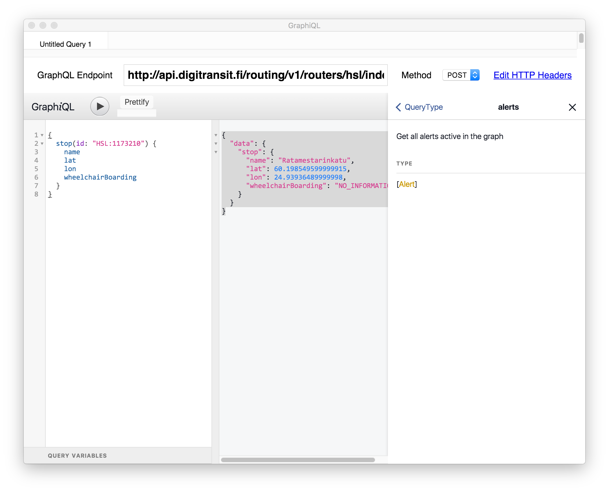

Routing queries can be made to GraphQL API.

# What is GraphQL?

[GraphQL](http://graphql.org/) is a standard created by Facebook. Basically, you can think it like "client side SQL". When implementing a GraphQL API, server developers defines a GraphQL schema that defines what can be queried. Instead of client calling REST-like urls, it generates different GraphQL queries and send these queries to API. Server parses the query, executes it, and returns results back to client.

## GraphQL benefits

There are many. You can read [how Facebook sees it](https://facebook.github.io/relay/docs/thinking-in-graphql.html). Also, [GraphQL site](http://graphql.org/) has some info for you.

# GraphQL API

Helsinki area API is available at:
> https://api.digitransit.fi/routing/v1/routers/hsl/index/graphql

Whole finland API is available at:
> https://api.digitransit.fi/routing/v1/routers/finland/index/graphql

### API requirements

API requires that
- HTTP method must be POST
- Content-Type: application/json header is present  

## cURL examples

Examples below send a GraphQL query as HTTP post to api.digitransit.fi. Example query asks server to find stop using id "HSL:11773210" and return its name, latitude and longitude coordinates, and whether is is accessible by wheelchair.

You can download cURL here:
> https://curl.haxx.se/

### Windows

TODO

### Linux & OSX

```
curl https://api.digitransit.fi/routing/v1/routers/hsl/index/graphql \
-H 'Content-Type: application/json' \
-d @- << DATA
{
  "query": "{
    stop(id: \"HSL:1173210\") {
      name
      lat
      lon
      wheelchairBoarding
    }
  }"
}
DATA
```

Some description for cURL parameters:
- -H 'Content-Type: application/json' defines correct Content-Type header
- -d @- tells cURL to read post data from STDIN
- << DATA defines [here documents code block](http://www.tldp.org/LDP/abs/html/here-docs.html)

### Making queries and exploring schema using GraphiQL

[GraphiQL](https://github.com/graphql/graphiql) is a simple UI for making queries. Not only can you use it run queries but also for exploring GraphQL schema. **It is highly recommended to use it.**

You have two options for using GraphiQL:
1) Use browser version: http://dev.hsl.fi/graphql/console/
2) For Mac OSX use desktop version: [GraphiQL app](https://github.com/skevy/graphiql-app)

Both options work similarly and UI looks more or less like this:


#### Execute your first query

1. Either [Download GraphiQL app for OSX](https://github.com/skevy/graphiql-app) or open [browser version](http://dev.hsl.fi/graphql/console/)

2. If you are using GraphiQL app, set "GraphQL Endpoint" to one of:
- Helsinki area: http://api.digitransit.fi/routing/v1/routers/hsl/index/graphql
- Finland: http://api.digitransit.fi/routing/v1/routers/finland/index/graphql

Browser version already uses endpoint:
- Helsinki area: http://api.digitransit.fi/routing/v1/routers/hsl/index/graphql

3. Copy this as query:

```
{
  stop(id: "HSL:1173210") {
    name
    lat
    lon
    wheelchairBoarding
  }
}
```

4. Press play to execute query

5. You should get result:

```
{
  "data": {
    "stop": {
      "name": "Ratamestarinkatu",
      "lat": 60.198549599999915,
      "lon": 24.93936489999998,
      "wheelchairBoarding": "NO_INFORMATION"
    }
  }
}
```

#### Differences betweet cURL and GraphiQL approaches

You might notice that in both cases we are working with "jsonish" data.
However, with cURL you are sending query as string like so:
```
{
  "query": "{...}"
}
```

Value for query is string that represents GraphQL query when sending data with cURL. When you work with GraphiQL, you are sending pure queries. This means that you only have to write query.

```
{...}
```

#### Exploring schema with GraphiQL

GraphiQL is schema aware. This means that you can invoke autocomplete by Ctrl-space. Tool then shows available options for query.


### Reading schema docs

By clicking "< docs" from upper right corner, you open documentation explorer. From there click on "query: QueryType" opens all top level queries available.


From here we can check e.g. "alerts", which describes what can be queried using that top level. It says "Get all alerts active in the graph".



Let's try to query that:

1. Close docs

2. Enter query
```
{
  alerts {
    alertDescriptionText
  }
}
```

3. Press "play" to execute your query


Depending on current situation you might get some disruption info


All top level queris should have at least some description available, use documentation browser to familiarize yourself with the schema.
