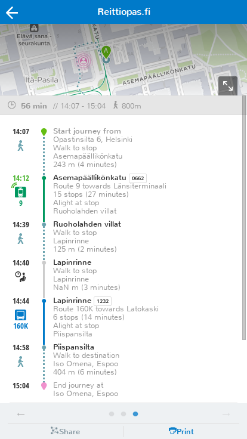
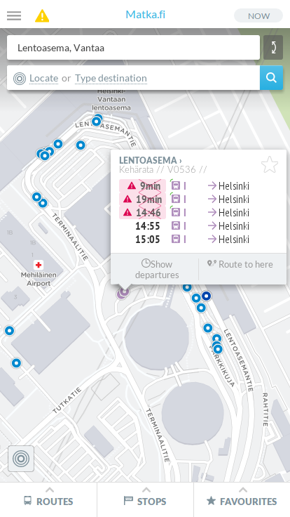
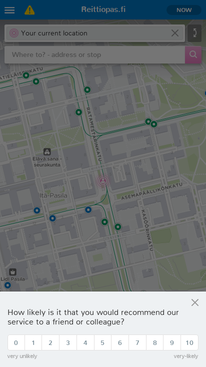

Tänään julkaistussa versiossa reittisivun kartta ei ole enää omalla alasivullaan, vaan näyttää reitin alun yläreunassa. Reittiä voi selata kartalla joko yläreunan pienessä näkymässä, tai suurentaa koko ruudun kokoiseksi kartan alanurkasta. Lipun ostolle varatun tilan sijaan reittiselostuksen yläpuolella näytetään nyt matkan kesto ja kävelyn määrä.

Lisäksi peruutukset näkyvät nyt pysäkkien tiedoissa, ja raideliikenteellä on pienet "hännät" merkkinä ajoneuvon suunnasta. Busseille häntää ei vielä valitettavasti piirretä, koska niiden sijaintitieto tulee pelkkänä paikkana ilman suuntaa.

iOS-käyttäjät voivat huomata listojen selauksen toimivan nyt myös sujuvammin; selaus ei enää pysähdy kuin seinään sormen noustessa näytöltä.

Pinnan alla käyttöliittymää on saatu hieman nopeammaksi poistamalla turhia verkkopyyntöjä, kansallisen version (beta.digitransit.fi) reitin hakuaikaa on pidennetty parempien tuloksien saamiseksi, ja pääsivusto (digitransit.fi) on saanut uutta sisältöä ja käännöksen englanniksi. Myös paikkojen hakua paranneltiin, ja bugeja korjailtiin.

Toissaviikolla HSL:llä oli myös vähän päälle kymmenen talon ulkopuolista testaajaa kokeilemassa uutta reittiopasta ja antamassa meille toiveita ja kritiikkiä. Testeissä katseltiin netissä olevan version lisäksi vasta paperille tulostettuja ideoita uudesta hausta ja reittitulossivusta.
