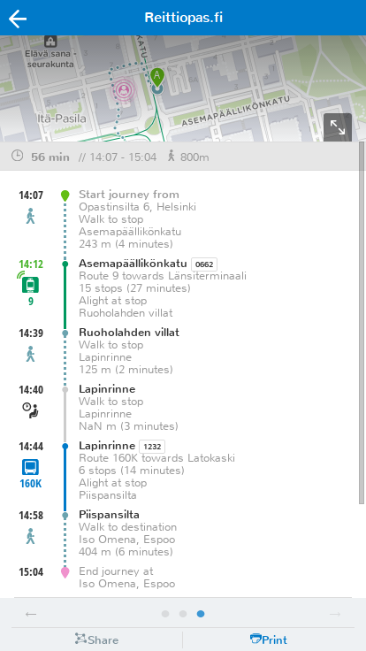
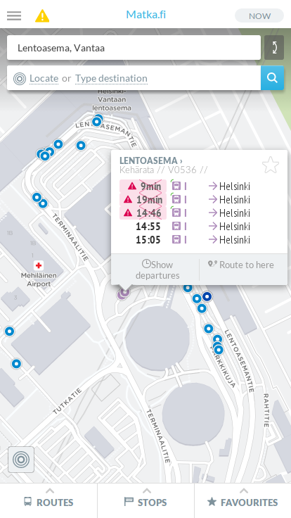
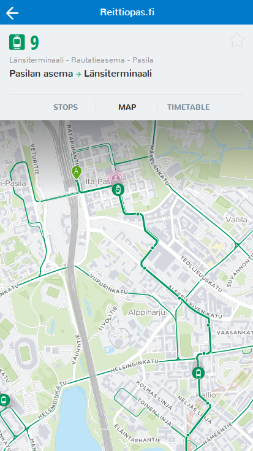
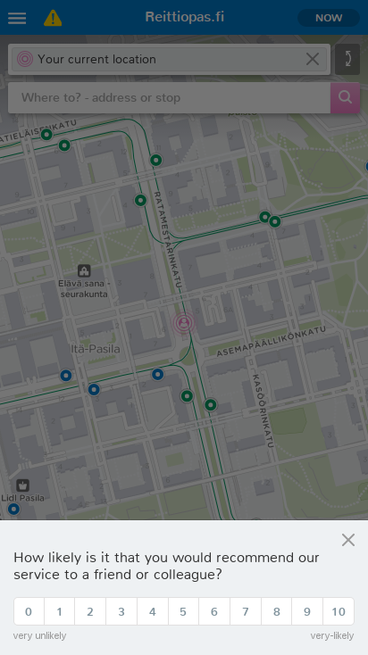

Tänään julkaistussa versiossa uutta:

1. Parannettu reittisivu
2. Peruttujen lähtöjen esittäminen
3. Ajoneuvojen liikkumissuunta selviää niiden "hännästä"
4. Palautekysely
5. Muita parannuksia

## Parannettu reittisivu
Reittisivun kartta ei ole enää omalla alasivullaan vaan se näyttää reitin alun sivun yläreunassa. Reittiä voi selata kartalla joko yläreunan pienessä näkymässä tai sen voi suurentaa koko ruudun kokoiseksi kartan alanurkasta. Lipun ostolle varatun tilan sijaan reittiselostuksen yläpuolella näytetään nyt matkan kesto ja kävelyn määrä.

Tiedossa olevia bugeja:
- Reittien pyyhkäisyele aiheuttaa käyttöliittymässä turhaa "liukumista joka suuntaan".
- Kartan asemointi klikkaamalla ei toimi kaikissa tilanteissa oikein.

## Peruttujen lähtöjen esittäminen
Peruutukset näkyvät nyt pysäkkien tiedoissa.

## Ajoneuvojen liikkumissuunta
Raideliikenteen ajoneuvoilla on pienet "hännät" merkkinä niiden suunnasta. Busseille häntää ei vielä valitettavasti piirretä, koska niiden sijaintitieto tulee pelkkänä paikkana ilman suuntaa.

## Palautekysely
Jotta voisimme seurata kehitystämme, käyttöliittymä kysyy nyt ajoittain palautetta.

## Muita parannuksia
iOS-käyttäjät voivat huomata listojen selauksen toimivan nyt sujuvammin; selaus ei enää pysähdy kuin seinään sormen noustessa näytöltä.

Käyttöliittymää on saatu hieman nopeammaksi poistamalla pinnan alta turhia verkkopyyntöjä, kansallisen version (beta.digitransit.fi) reitin hakuaikaa on pidennetty parempien tuloksien saamiseksi, ja pääsivusto (digitransit.fi) on saanut uutta sisältöä ja käännöksen englanniksi. Myös paikkojen hakua on paranneltu ja bugeja korjailtu.

Toissaviikolla HSL:llä oli reilu kymmenen talon ulkopuolista testaajaa kokeilemassa uutta reittiopasta ja antamassa palautetta. Kiitos heille!

## Kokeile uusia ominaisuuksia
- HSL-alue: http://matka.hsl.fi/
- Suomi: http://beta.digitransit.fi/

## Seuraava julkaisu
Seuraavan 2 viikon ajan keskitymme pääosin parantamaan etusivua:
- Pysäkit-välilehti poistuu. Jatkossa välilehtiä on kaksi: Lähelläsi ja Suosikit.
- "Lähelläsi" on jalostettu versio nykyisestä Linjat-välilehdestä.
- "Suosikit" toteutetaan uutena ominaisuutena.
- Hakua parannetaan.

Tarkempi suunnitelma: https://digitransit.atlassian.net/issues/?filter=10300
