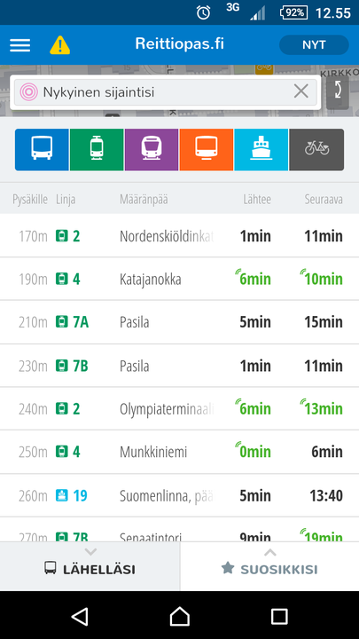
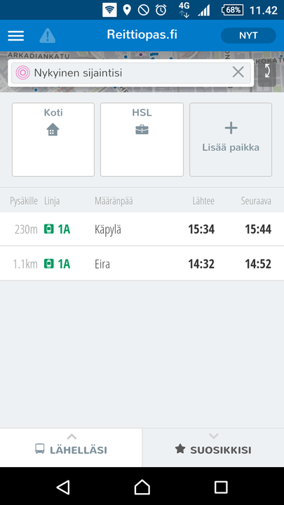
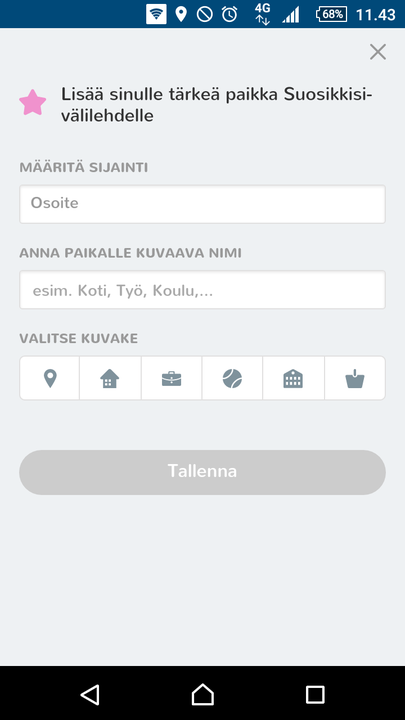
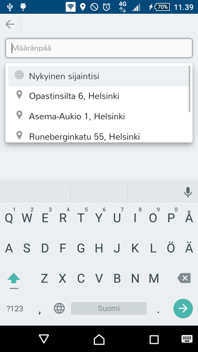

Tänään julkaistussa versiossa uutta:

1. Etusivun "Lähelläsi"
2. Etusivun "Suosikkisi"
3. Parannettu haku
4. Parannettu taustakartta

## Etusivun "Lähelläsi"
Etusivua on yksinkertaistettu. "Lähelläsi"-näkymä listaa kaksi seuraavaa lähtöä kullekin läheltä lähtevälle linjalle. Listalle haetaan lähtöjä 20 lähimmästä pysäkistä muutaman tunnin ajalta.

Tiedossa olevia puutteita:
- Metrot Helsingin keskustassa eivät tule listalle

## Etusivun "Suosikkisi"
"Suosikkisi"-näkymä mahdollistaa kahdentyyppisiä suosikkeja: kohteita sekä linjoja.

*Suosikkikohde* on paikka, esim. koti, jonne sovellus suunnittelee helposti reitin käyttäjän nykyisestä sijainnista.

*Suosikkilinja* on käyttäjän suosikiksi merkitsemä linja, josta sovellus hakee lähimmän lähdön käyttäjän sijainnin perusteella.

Suosikkipaikkojen lisääminen on helppoa:

Tiedossa olevia puutteita:
- Suosikkikohteita ei voi poistaa
- Suosikkikohteita on vain kolme
- Suosikkilinjat lista hidastuu mikäli suosikkeja on liikaa

## Parannettu haku
Kehitämme käyttöliittymää "Mobile first" –hengessä. Tämä tarkoittaa että käyttöliittymä sovitetaan ensin matkapuhelimiin sopiviksi ja työpöytäversio seuraa tuonnempana. Uudistettu haku on vahvasti mobiilikonvention mukainen ja se voi tuntua työpöytäselaimella erikoiselta. Tästä ei kannata huolestua.

Uusi haku mahdollistaa selkeämmät hakutulokset. Haku tehdään "omalla sivullaan" ja se mahdollistaa edellisten hakujen käyttämisen.

Tiedossa olevia puutteita:
- Hakutulosta ei pysty tyhjentämään nopeasti
- Haku ei kohdistu suosikkipaikkoihin

## Parannettu taustakartta
Taustakartan tyyliä on selkeytetty ja sinne on tuotu näkymiin mm. metroasemien sisäänkäynnit.

## Kokeile uusia ominaisuuksia
- HSL-alue: http://matka.hsl.fi/
- Suomi: http://beta.digitransit.fi/
