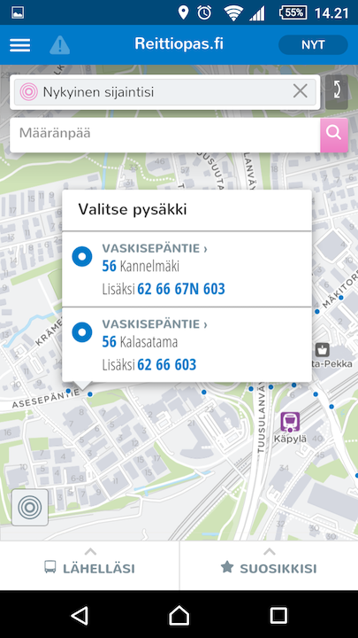

Tänään julkaistussa versiossa uutta:

1. Etusivun "Lähelläsi"
2. Etusivun "Suosikkisi"
3. Uusi hakuikkuna
4. Selkeytetty taustakartta

## Etusivun "Lähelläsi"
Yksinkertaistimme etusivua. "Lähelläsi"-näkymä listaa kaksi seuraavaa lähtöä kullekin läheltä lähtevälle linjalle. Listalle haetaan lähtöjä tällä hetkellä 20 lähimmästä pysäkistä parin tunnin ajalta.

Tiedossa olevia puutteita:
- Metrot Helsingin keskustassa eivät tule listalle
- Suorituskyky on huono hitailla puhelimilla

## Etusivun "Suosikkisi"
"Suosikkisi"-näkymä mahdollistaa tällä hetkellä kahdentyyppisiä suosikkeja: kohteita sekä linjoja.

*Suosikkikohde* on paikka, esim. koti, jonne sovellus suunnittelee helposti reitin käyttäjän nykyisestä sijainnista.

*Suosikkilinja* on suosikiksi merkitty linja, josta sovellus hakee lähimmän lähdön käyttäjän senhetkisen sijainnin perusteella.

Suosikkipaikkojen lisääminen on helppoa:

Tiedossa olevia puutteita:
- Suosikkikohteita ei voi vielä poistaa
- Suosikkikohteita on maksimissaan kolme
- Suosikkikohteen painikkeessa ei vielä näytetä mitään reitin tietoja. Tarkoitus on näyttää suoraan koska pitäisi lähteä, jos haluaa lähteä kohteeseen.
- Suosikkilinjat lista hidastuu liikaa mikäli suosikkeja lisää paljon

## Uusi hakuikkuna
Kehitämme käyttöliittymää "Mobile first" –hengessä. Tämä tarkoittaa että käyttöliittymä sovitetaan ensin matkapuhelimiin sopiviksi ja työpöytäversio seuraa tuonnempana. Uudistettu haku on vahvasti mobiilikonvention mukainen ja se voi tuntua työpöytäselaimella erikoiselta. Tästä ei kannata huolestua.

Uusi haku mahdollistaa entistä selkeämmät hakutulokset. Haku tehdään "omalla sivullaan" ja se mahdollistaa edellisten hakujen käyttämisen.

Tiedossa olevia puutteita:
- Hakutulosta ei pysty tyhjentämään nopeasti
- Haku ei kohdistu suosikkipaikkoihin

## Selkeytetty taustakartta
Taustakartan tyyliä on selkeytetty ja sinne on tuotu näkymiin mm. metroasemien sisäänkäynnit.

Kartalta voi myös valita avattavan pysäkin, mikäli klikkauksen lähellä on usea pysäkki.

## Kokeile uusia ominaisuuksia
- HSL-alue: http://matka.hsl.fi/
- Suomi: http://beta.digitransit.fi/
