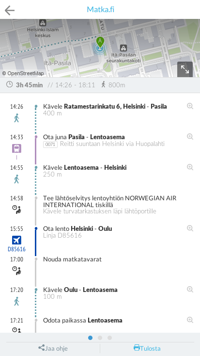
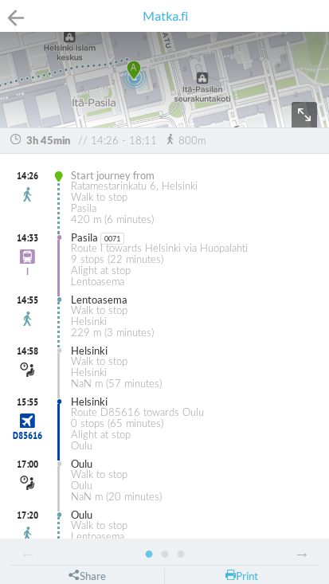
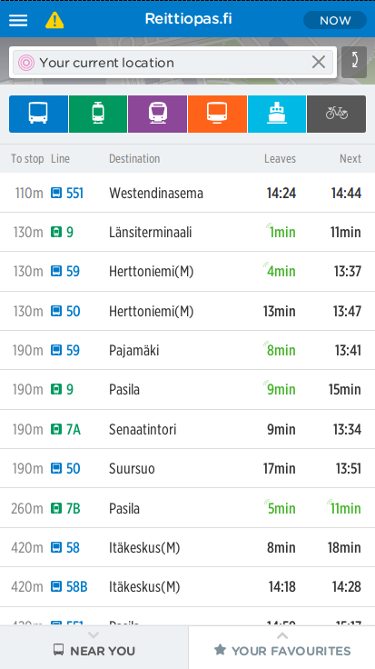
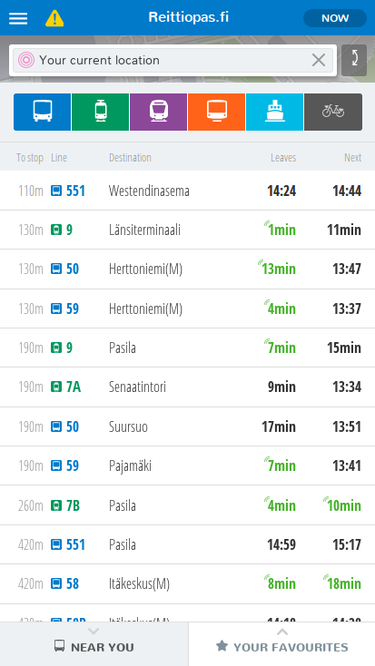

Tänään julkaistussa versiossa uutta:

1. Reittisivu
2. Uusi fontti
3. Kehittäjille: dokumentaatiota lisätty
4. Kehittäjille: palvelut ovat saatavilla Docker Hubista

## Reittisivu
Reittisivua on paranneltu monella tavalla:
tekstiä on vähemmän ja paikat ovat paksummalla fontilla selkeyden parantamiseksi,
lentoyhteydet näyttävät myös lentoyhtiön lähtöselvitystiskin,
kartta avautuu suureksi klikkaamalla pientä karttaa mistä tahansa,
kartan siirto reitin osien tekstejä klikkaamalla toimii paremmin,
odotuksissa ei ole virheellistä matkan pituutta metreinä, ja
vieritys sivuttain ja pystysuunnassa on eroteltu,
jotta reittiä voisi vierittää helpommin vaihtamatta vahingossa toiseen reittiin.

Uusi sivu on myös nopeampi, minkä huomaa erityisesti vanhemmilla puhelimilla.

Tiedossa olevia puutteita:
- Käännökset eivät ole vielä valmiita; suomeksi ei näytetä reitin osien pituuksia minuutteina, ja englanniksi ne näytetään suomeksi.
- Graafisia yksityiskohtia hiotaan vielä

## Uudet fontit HSL-versioon
HSL-versio on päivitetty HSL:n virallisiin fontteihin (kirjasintyyppeihin),
jotka ovat hieman edellistä paksumpia.
Fontteja käytetään nyt systemaattisemmin, ja eri leikkauksia on nyt kuusi.

Myös kontrastia on paikoitellen lisätty.

## Kehittäjille: dokumentaatiota lisätty

[Kehittäjien dokumentaatiota](http://digitransit.fi/en/developers/) on uudistettu
ja laajennettu.

## Kehittäjille: palvelut ovat saatavilla Docker Hubista
Palvelut ovat ladattavissa [Docker imageina Docker Hubista](https://hub.docker.com/r/hsldevcom/)

## Kokeile uusia ominaisuuksia
- HSL-alue: http://matka.hsl.fi/
- Suomi: http://beta.digitransit.fi/
