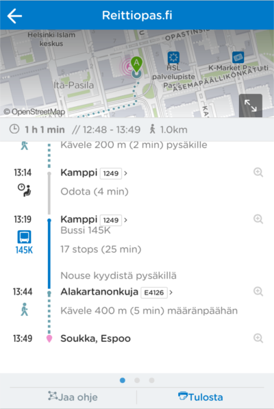
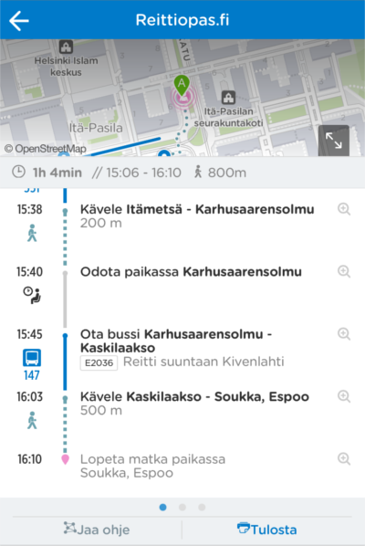

Tänään julkaistussa versiossa uutta:

1. Reittisivu
2. Lautausnopeustietojen keräys
3. Suosikkipaikka
4. Helpoitettu käyttöä Suomen ulkopuolella
5. Kansainvälinen yhteistyö
6. Kehittäjille: GraphQL rajapinta reitin suunnitteluun
7. Muita parannuksia

## Reittisivu
Reittisivua on parannettu entisestään:
Reittiohjeita on selkeytetty siten,
että nyt kunkin matkataipaleen otsikkona on vain paikka/pysäkki,
ja tarkemmat ohjeet näytetään vasta sen alapuolella.
Puuttuvia pysäkkinumeroita on lisätty, samoin ajoneuvon tunnisteita (esim. bussi 58).
Uudessa versiossa käyttäjälle näytetään tieto matkan eri vaiheiden kestosta.
Jotta käyttäjä osaisi paremmin arvioida milloin jäädä bussista pois,
on reittiohjeisiin lisätty tieto reitillä olevien välipysäkkien määrästä.
Kielikäännöksiä on myös lisätty ja parannettu.

Tiedossa olevia puutteita:
- Kaikki käännökset eivät ole vielä valmiita
- Pysäkkitunnisteita ei löydy kaikista pysäkeistä
- Graafisia yksityiskohtia hiotaan vielä

## Latausnopeustietojen keräys
Eri päätelaitteiden suorituskyvyissä on huomattavia eroja.
Älypuhelimet ovat ymmärrettävästi vähemmän tehokkaita tietokoneisiin verrattuna.
Mutta myös eri älypuhelinten välillä on merkittäviä eroja suorituskyvyissä.

Digitransit haluaa palvella kattavasti eri päätelaitteiden käyttäjiä, tinkimättä kuitenkaan
ominaisuuksista liikaa. Jotta voimme luoda käyttäjille parhaan mahdollisen käyttökokemuksen,
on hyödyllistä tietää kuinka hyvin eri päätelaitteet suoriutuvat sovelluksen eri toiminnoista.

Nyt uudistuneessa digitransitissa kerätään sovelluksen latausnopeustietoja eri laitteiden väliltä.
Näin sovelluksen eri sivujen latautumisista saadaan tärkeitä tietoja, joiden avulla sovelluskehitys
voidaan suunnata luomaan entistä parempi ja sujuvampi käyttökokemus.

## Parannettu Suosikkipaikka -toiminnallisuus
Suosikit välilehdeltä löytyvää suosikkipaikka -toiminnallisuutta on parannettu.
Digitransitissa käyttäjä voi määrittää sijainnin suosikikseen, jonka jälkeen
siihen voi tehdä reittihaun vaivattomasti parilla painalluksella. Nyt uudistuneessa
suosikkipaikka -toiminnallisuudessa käyttäjä näkee yhä helpommin tietoja suosikkipaikoistaan.
Suosikit -välilehdeltä käyttäjä näkee heti kaikista suosikeistaan seuraavat tiedot:
Arvioidun kohteeseen saapumisajan ja milloin täytyy viimeistään lähteä kävelemään pysäkille.

## Helpoitettu käyttöä Suomen ulkopuolella

Uudessa versiossa digitransit on helpompi käyttää Suomen ulkopuolelta. Vanha versio
paikansi ulkomaan käyttäjän alueelle, jossa digitransit ei ole käytössä, mikä heikensi käyttökokemusta.
Uusi versio paikantaa ulkomaisen käyttäjän Helsinki-Vantaan lentoasemalle.

## Kansainvälinen yhteistyö

Viime aikoina digitransitin avoimen lähdekoodin lähestymistapa on alkanut tuottaa hedelmiä. Olemme saaneet
yhteistyökumppanin Norjasta, ja viimeiseksi myös Ranskasta. Etenkin Norjalaisten kanssa yhteistyö on jo
syventynyt, ja olemme hyötyneet selvästi toistemme sovelluskehityksestä.
Ulkomaiset yhteistyökumppanit ovat tuoneet myös lisää käyttökieliä palveluun:
Digitransit toimii nyt edellisten kielien lisäksi norjaksi ja ranskaksi.

## Kehittäjille: GraphQL rajapinta reitin suunnitteluun
Digitransit Routing API tukee nyt [reittisuunnittelua GraphQL rajapinnan yli](/en/developers/service-catalogue/apis/routing-api/).

## Muita parannuksia
Kielistyksiä on lisätty ja korjattu. Muun muassa poikkeusinfon näyttäminen väärällä kielellä on nyt korjattu.

## Kokeile uusia ominaisuuksia
- HSL-alue: http://matka.hsl.fi/
- Suomi: http://beta.digitransit.fi/
