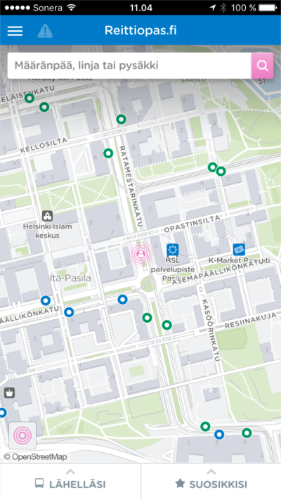
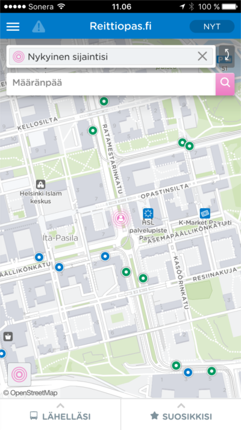
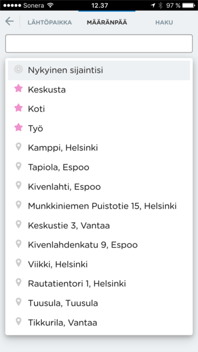
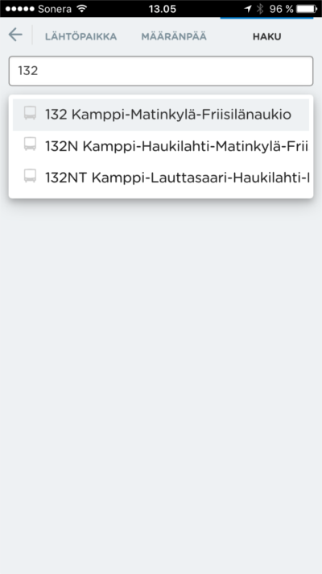
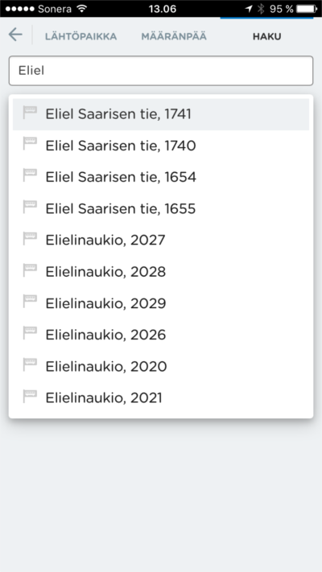
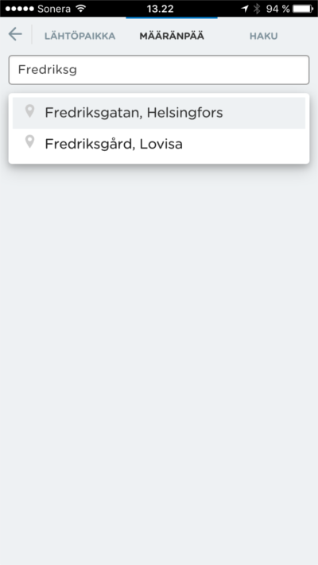
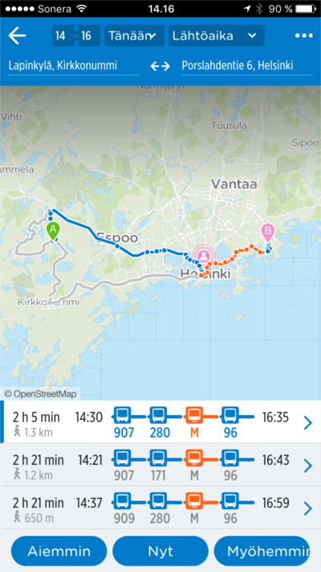
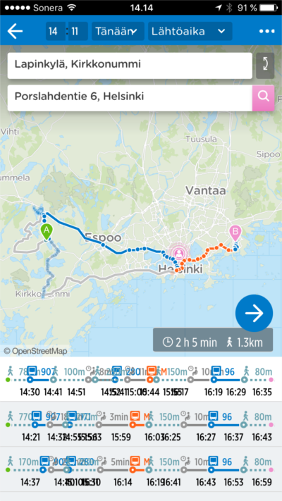

Tänään julkaistussa versiossa uutta:

1. Yksi hakukenttä
2. Pysäkkien ja linjojen haku
3. Reittihaku ruotsinkielisiellä osoitteilla
4. Uudistettu reittiyhteenvetosivu
5. Muita parannuksia

## Yksi hakukenttä
Käyttöliittymässä kokeillaan yhden hakukentän mallia. Yhden hakukentän
mallissa aloitussivulla on näkyvissä vain yksi hakukenttä, jolla käyttäjä
suorittaa reittihakuja. Hakukentän valinta vie käyttäjän omalle sivulleen, jossa haut suoritetaan.
Alla olevista kuvista vasemmalla on uusi, oikealla vanha näkymä.

### Haku sivun näkymä uudessa versiossa:

## Pysäkkien ja linjojen haku
Nyt sovelluksella voi hakea myös pysäkkejä ja linjoja! Haun kautta voit nopeasti
löytää eri linjojen aikataulut. Pysäkkiä haettaessa haku palauttaa valitun pysäkin
linjojen lähdöt ja arvioidut ohitusajat. Alla vasemmalla linjahaku ja oikealla pysäkkihaku.

## Reittihaku ruotsinkielisillä osoitteilla
Sovellus tukee nyt paikoitellen ruotsinkielisiä hakuja. Esim. "Nordsjö" ja "Borgbacken" haut palauttavat haluttuja tuloksia ruotsiksi.
Toiminnallisuus paranttuu lähitulevaisuudessa.

## Uudistettu reittiyhteenvetosivu
Reitin yhteenvetosivua on paranneltu monilta osin. Sivun alaosasta löytyviä reittikuvauksia
on selkeytetty näyttämään vain oleellisin reitillä tarvittava tieto. Tämä mahdollistaa sen,
että tarvittavat tiedot voidaan näyttää selkeämmin ja suuremmassa koossa. Sen myötä monet visuaaliset
ongelmat ovat vähentyneet. Tarkempiin reitin tietoihin pääsee riviä uudelleen painettaessa.

Aivan sivun alareunaan on lisätty painikkeita joiden avulla matkan ajankohtaa voi nopeasti muuttaa
suhteessa alkuperäiseen aikaan. Lisätyt painikkeet ovat "Aiemmin", "Nyt" ja "Myöhemmin". "Aiemmin"
painikkeesta saa nopeasti esille aikaisemmin perille saapuvia reittiehdotuksia. "Nyt" -painikkeella
voi palata tarkastelemaan nykyhetkestä löytyviä reittejä. Ja "Myöhemmin" -painikkeesta näytetään
myöhemmin lähteviä reittiehdotuksia.

Sivun yläosan matkan päätepistekentät on päivitetty. Uudet kentät on tiivistetty yhdelle riville antaen
kartalle enemmän tilaa. Sivun ylimmältä riviltä löytyvä ajanhallintavalikko on tarkoitus uudistaa ja uudelleen
sijoittaa päätepistekenttien alle. Alla vasemmalla on uusi, oikealla vanha näkymä:

## Muita parannuksia
Reittisivun reittikuvauksia on yhdenmukaistettu eri kulkumuotojen osalta. Tämän lisäksi korjattu
reittiohje näyttämään oikein tilanteessa jossa kulkumuotona on oma auto.

Kartan liikuttamisen sulavuutta on parannettu. Varsinkin heikoimmilla puhelimilla on huomattu merkittävä
parannus entiseen.

## Kokeile uusia ominaisuuksia
- HSL-alue: http://matka.hsl.fi/
- Suomi: http://beta.digitransit.fi/
