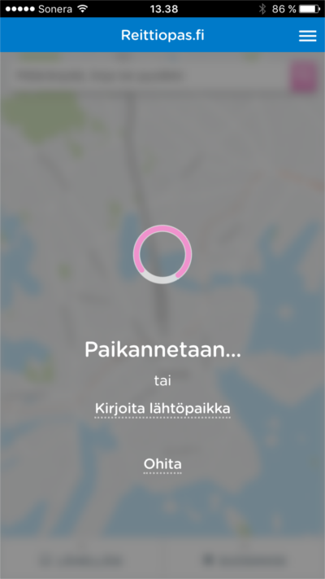
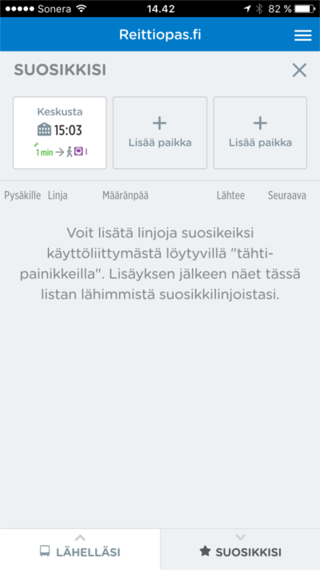
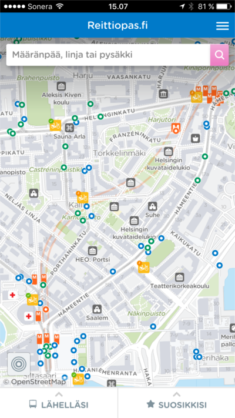

Tänään julkaistussa Urpo -versiossa uutta:

1. Uusi aloitusnäkymä
2. Digitransit.fi IE11 tuki
3. Paranneltu reititysdokumentaatio
4. Parannus suosikkipaikka -ominaisuuteen
5. Lähtöpaikan ponnahdusikkunan aukioloaika
6. Kaupunkipyöriin liittyvät uudistukset
7. TLS-salaus
8. Muita parannuksia

## Uusi aloitusnäkymä
Sovelluksesta on tehty yksinkertaisempi lisäämällä sovelluksen alkuun aloitusnäkymä,
jonka tehtävänä on määrittää käyttäjälle sijainti tavalla tai toisella. Ensisijaisesti
käytetään paikannusta. Jos se ei ole käytettävissä, on käyttäjällä mahdollisuus
asettaa oma sijainti itse, tai ohittaa vaihe jolloin ohjelma määritää aloitussijainnin
itse Helsingin päärautatieasemalle (HSL:n sovellusversiossa). Sijainnin ansiosta
kaikki sovelluksen ominaisuudet ovat heti vaivattomasti käytettävissä.

## Digitransit.fi IE11 tuki:

Digitransit.fi sivusto päivitettiin tukemaan Internet Explorerin versiota numero 11,
jolla voi nyt käyttää sivua täysillä ominaisuuksilla.

## Paranneltu reititysdokumentaatio
[Reititysdokumentaatiota](https://digitransit.fi/en/developers/services-and-apis/1-routing-api/) on parannettu lisäämällä esimerkkejä.

## Parannus suosikkipaikka -ominaisuuteen
Suosikkipaikka -ominaisuutta on parannettu näyttämään helpommin suosikkireitistä informaatiota.
Uudessa versiossa suosikkipaikasta näkee heti jo ensimmäisen ajoneuvon tiedot.

## Lähtöpaikan ponnahdusikkunan aukioloaika
Lähtöpaikan ponnahdusikkunan aukioloaikaa pidennetty. Aikaisemmin ponnahdusikkuna
oli auki vain 5 sekuntia. Nyt ponnahdusikkuna pysyy auki niin kauan kunnes sivua vaihdetaan, tai
jokin toinen ponnahdusikkuna avataan. Uudistus helpottaa käyttäjän lähtöpaikan asettamista.

## Kaupunkipyöriin liittyvät uudistukset
Sovelluksen kartalta löytyvien kaupunkipyöräasemien yhteyteen on lisätty aseman tilasta kertova
ikoni. Tämän ansiosta käyttäjä näkee nopeammin kartalta onko asema käytössä, onko siellä vapaita
pyöriä, ja voiko sinne palauttaa pyörän.

Tämän lisäksi kaupunkipyöräasemien tiedot päivittyy nyt sovelluksessa reaaliaikaisesti. Aseman ponnahdusikkunan
tyyliä on myös hieman muokattu.

## TLS-salaus
Sovelluksessa on otettu käyttöön TLS-salaus (Transport Layer Security). TLS-salauksella suojataan
sovelluksen tietoliikenne julkisten IP-verkkojen yli. TLS salaa tietoliikenteen käyttämällä
symmetristä kryptausta. Salauksen lisäksi TLS:llä vahvistetaan serverin identiteetti, ja
viestien eheys.

## Muita parannuksia
Tämän kertaisessa päivityksessä on jälleen useiden bugien korjauksia ja pieniä parannuksia.
Yksi näistä on reittihaun määränpään ja asetusten tyhjentäminen käyttäjän palatessa aloitusruutuun.

## Kokeile uusia ominaisuuksia
- HSL-alue: http://beta.reittiopas.fi/
- Suomi: http://beta.digitransit.fi/
