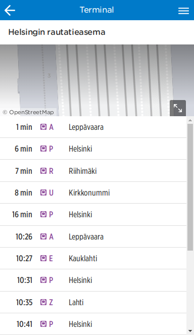
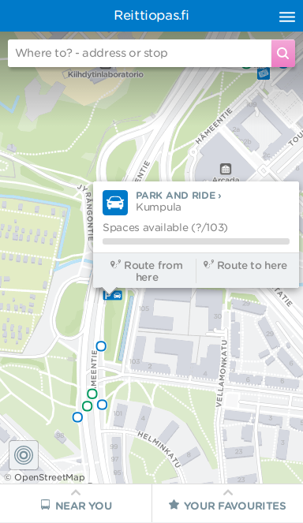
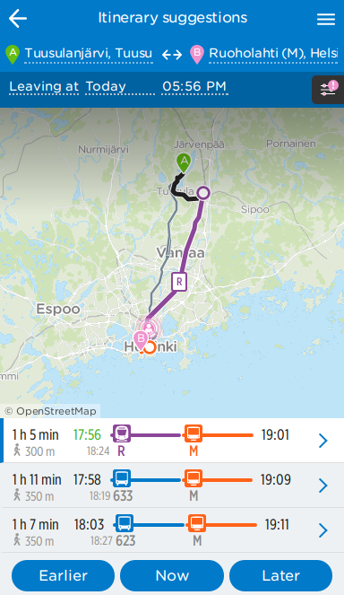
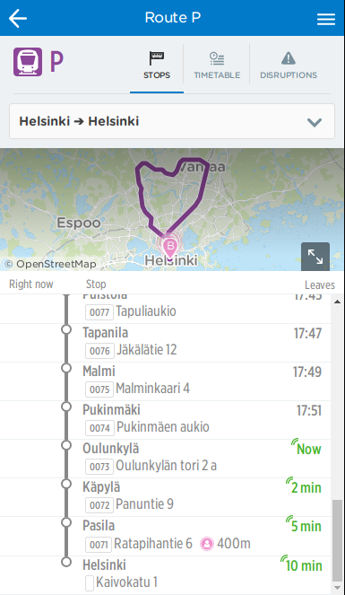
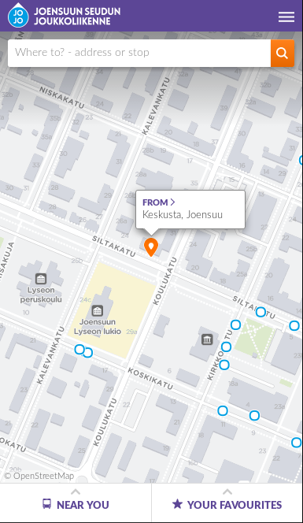

Edellisestä päivityksestä on aikaa.
Eemeli-versioon on edellisen kahden viikon aikana tehty:

1. Terminaalit
2. Park and ride
3. Päivittynyt linjasivu
4. Uusi lähialueen suodatus
5. Haun parannuksia

Lisäksi kesän aikana on ehtinyt toteutua kasa muita ominaisuuksia.

## Terminaalit
Digitransit ymmärtää nyt mitä terminaalit ovat
ja yhdistää kartalle saman terminaalin eri pysäkit, laiturit, yhdeksi symboliksi.
Popupista, ja terminaalin sivuilta voi nähdä kaikkien laitureiden
seuraavat lähdöt yhtäaikaa.

## Park and ride
Kartalle on nyt lisätty liityntäpysäköintipaikat. Nämä otetaan huomioon myös reittituloksissa,
kun pääkulkumuodoksi on valittu kävelyn sijaan autoilu. Digitransitissa on valmius ottaa parkkilaitosten vapaiden paikkojen määrä huomioon, kun alamme saada reaaliaikatietoa täyttöasteesta.

Kesän aikana reittiyhteenveto on muuttunut myös designiltaan.

## Päivittynyt linjasivu
Linjasivun design on muuttunut aika paljon sitten loppukevään,
ja lähdön sivu on myös sulautunut samaan.
Kesällä myös lenkin tekevät linjat saatiin mahtumaan kartalle,
eikä kartta zoomaa enää vain alku- ja loppupisteiden mukaan.
Sama muutos näkyy kaikkien sivujen kartoilla (kuten reittituloksissa).

## Uusi lähialueen suodatus
Uudistetussa etusivun lähialuetabissa voi olla valittuna joko kaikki kulkumuodot,
tai vain yksi, esimerkiksi lähimmät raitiovaunut.
Tietyn muodon lähtöjen etsiminen on nyt nopeampaa,
kun kaikkia muita ei tarvitse ottaa päältä yksi kerrallaan.

## Haun parannuksia
Kesällä hakuun tuotiin saman rakennuksen muut osoitteet,
esimerkiksi korttelin kulmassa oleville taloille.
Samoin osoitteet nostetaan pysäkkejä korkeammalle tuloksissa,
ja viimeisimpänä viime sprintissä osoitteet laitettiin aakkosjärjestykseen.

## Tärkeimmät kesän aikana tapahtuneet
Kesän lopusta lähtien reittihaun alku- ja loppupisteen on voinut valita kartalta.
Kosketusnäytöllä valinnat saa esiin pitkällä painalluksella,
ja hiirellä oikealla klikkauksella.

Digitransittiin ilmestyi myös mahdollisuus näyttää käyttäjälle viestejä yläpalkissa.
Poikkeusinfo, kuten peruutukset, näkyy kuitenkin suoraan lähtöjen riveillä,
kuten erusivun pysäkkipopupeissa ja lähialuenäkymässä.

Kesäkuun puolivälissä digitransit-tiimi teki matkan Joensuuhun,
ja toteutti samalla JoJolle [oman version digitransitista](https://joensuu.digitransit.fi/).

Aloimme myös valvomaan tarkemmin palvelun pystyssä pysymistä käyttäen
[Pingdomia](http://stats.pingdom.com/8m4jkk8to88b)
ja tarkastamme automaattisesti ettei
[tyylioppaan](https://beta.reittiopas.fi/styleguide) komponentit muutu vahingossa.

## Tulossa seuraavaksi
Seuraavissa sprinteissä meillä on työn alla suosikkien poistaminen,
ja linjojen, pysäkkien, pyöräasemat ja parkkipaikat lisääminen suosikkitabiin.

## Kokeile uusia ominaisuuksia
- HSL-alue: http://beta.reittiopas.fi/
- Suomi: http://beta.matka.fi/
