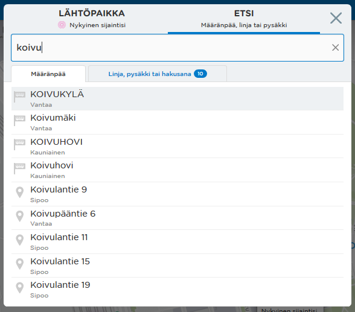
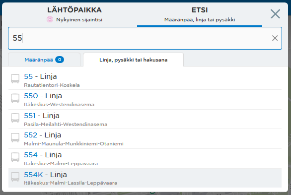
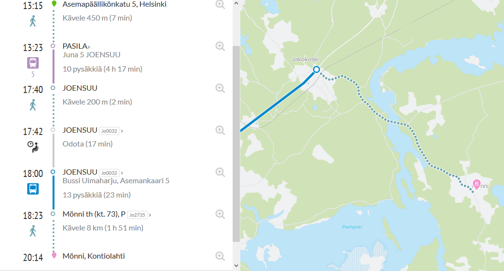
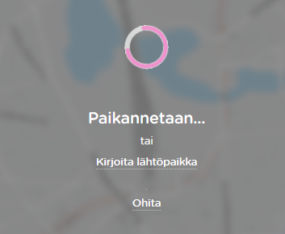
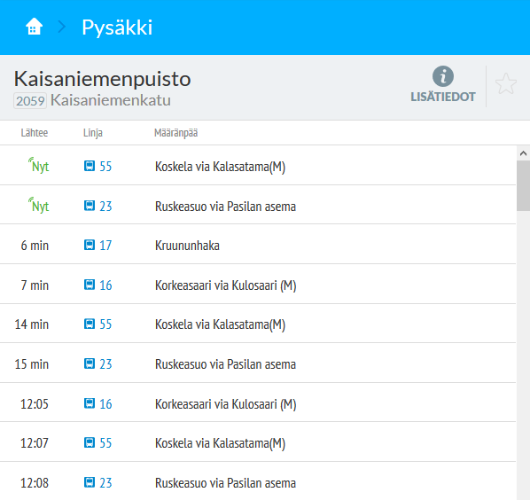
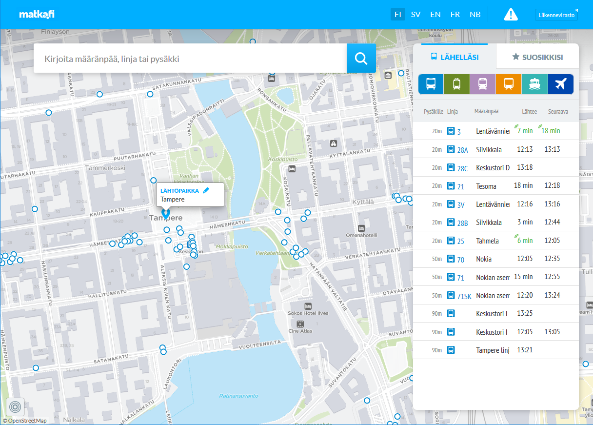

Edellisessä kahden viikon sprintissä on toteutettu:

### Hakutoiminnallisuuden käytettävyyttä on parannettu
Käyttöliittymää on yksinkertaistettu, niin että ennen hakutermin syöttämistä ei tarvitse tehdä valintoja. Lisäksi hakutulos jaetaan kahteen kategoriaan, sen mukaan onko kyseessä osoite, paikka, pysäkki tms pistemäinen kohde vai linja. Lähtöpaikka ilmaistaan aiempaa selkeämmin.

### Kansallinen reititys 
Reititys löytää pidempiä kävelymatkoja, jolloin tulee vähemmän "reittiä ei löydy" -vastauksia

### Nyt-nappula
Reittiehdotusta voi päivittää "Nyt" nappulasta, niin että reititys osaa ottaa huomioon matkustajan muuttuneen sijainnin (silloin kun lähtöpaikkana käytetään omaa sijaintia).

### Uusi yläpalkki
Desktop version yläpalkki on uusittu

### Aloituskuva
Palveluun ensimmäistä kertaa tuleville tai jos paikannusta ei ole saatavilla tilanteessa näytettävä näkymä on uusittu.

### Via-tieto
Reittien via-pisteet lisätty lähtöjen listaan.

### Osoitehaku
Osoitehakua on nopeutettu välimuistin avulla.

### Käyttöpalvelu
Käyttöpalvelun rakentamista Azure-ympäristöön on jatkettu

### Bugikorjauksia
Useita pieniä parannuksia

### Aiemmin syksyn aikana kehitettyjä ominaisuuksia

- Desktop –versio

- Liityntäpysäköinnin tuki
- Lähdön ja määränpään valintatoiminnallisuus lisätty karttanäkymään
- Lisätty kaupunkipyörien toiminnallisuus kartalle
- Poistettu kaupunkipyörät näkyvistä talvikauden ajaksi, koska kaupunkipyöräjärjestelmä ei ole silloin käytössä
- Suosikkipaikkojen muokkaus tehty mahdolliseksi
- Saapuvat ajoneuvot lisätty kartta pop-uppiin
- Lisätty terminaalinäkymä, joka sisältää koosteen kaikista terminaalin lähdöistä
- Geokoodausta on paranneltu
-- käyttää parempaa lähtöaineistoa
-- antaa parempia hakutuloksia
-- testauksen kattavuutta lisätty
- Käyttöliittymän testaus automatisoitu
- Hintatiedot HSL:n matkoille lisätty
- Käyttöliittymän ylälaitaan on lisätty info-viesti ensimmäistä kertaa saapuville käyttäjille
- Tietoa palvelusta –sivu
- Yleisiä käyttöliittymän suorituskykyparannuksia
- Reitityksen suorituskykyä parannettu
- Räätälöity Föli -versio Turun seudulle
- Useita visuaalisia parannuksia HSL-, Joensuu-, Turku-versioihin sekä matka.fi -versioon
- Lisäksi lähes joka näkymää on kehitetty ja käytettävyystestin perusteella käytettävyyttä on parannettu mm. 
  * pysäkkisivulla
  * terminaalisivulla
  * linjasivulla
  * reittiyhteenvedossa
  * reittisivulla

## Kokeile uusia ominaisuuksia
- HSL-alue: https://beta.reittiopas.fi/
- Suomi: https://beta.matka.fi/
- Turku: https://turku.digitransit.fi/
- Joensuu: https://joensuu.digitransit.fi
