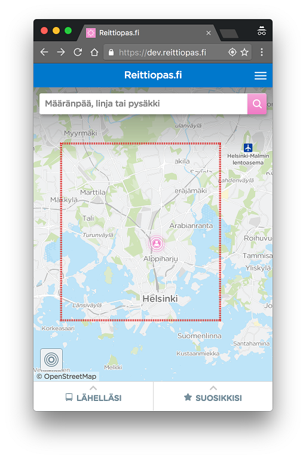
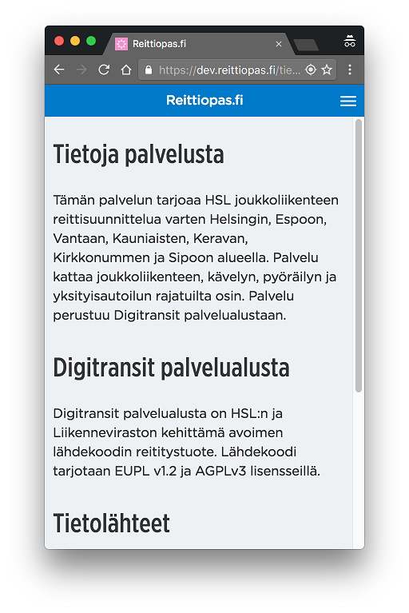
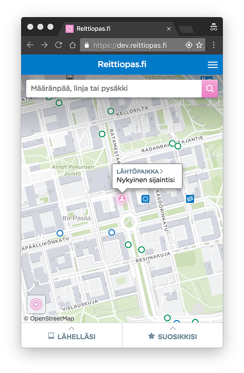
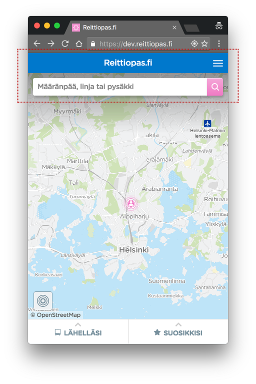

## Liittymisprosessi

Toimita alla kuvatut tiedot digitransit@hsl.fi osoitteeseen.

### 1. Sovi yhteistyöstä LMJ Oy:n kanssa

Sovi käyttöönotosta LMJ Oy:n kanssa.

### 2. Nimeä organisaatiosi palveluvastaava

Nimeä organisaatiostasi palveluvastaava. Hän vastaa Digitransit-palveluun liittyvästä operatiivisesta kommunikoinnista ja on kontaktoimamme henkilö ongelmatilanteissa.

### 3. Ilmoita palveluvastaavan yhteystiedot

Ilmoita palveluvastaavan:
- Nimi
- Sähköposti
- Puhelinnumero

### 4. Domain nimi

Liikenne Digitransit-palveluun on aina https-salattu. Voit valita vapaasti palvelusi domain-nimen (esim. https://reittiopas.kaupunki.fi), jolloin tarvitsemme TLS-sertifikaatin, joka sinun tulee hankkia. Voit myös käyttää https://kaupunki.digitransit.fi -osoitetta, jolloin erillista sertifikaattia ei tarvita. Kuvaa/toimita:
- Domain Nimi
- TLS sertifikaatti, mikäli haluat oman domain nimen

### 5. Reittidata

Digitransit-palvelu integroi reittidatasi GTFS-muodossa. Tiedot on mahdollista myös noutaa Waltti-järjestelmästä. Kuvaa:
- Web palvelun osoite, josta GTFS-paketti on saatavilla

Varmista, että GTFS-paketin data on kunnossa käyttämällä esimerikiksi Googlen GTFS-validaattoria:

- Lataa GTFS
- Lataa https://github.com/google/transitfeed/releases/latest ja pura
- Mene validaattorin kansioon ja aja `./feedvalidator.py -m <gtfs.zipin polku>`

**Huom: Waltti ei toistaiseksi käsittele reittien geometriaa ja siksi Waltista haetut reitit esitetään Digitransitissa tikkuverkkona.**

### 6. Kulkumuodot


Määritä reittidatastasi löytyvät kulkumuodot. Valittujen kulkumuotojen perusteella käyttäjä voi rajata liikennetarjontaa. Kuvaa kullekin seuraavista kulkumuodoista onko sille tarvetta:
- Bussi
- Juna
- Metro
- Raitiovaunu
- Lentokone
- Lautta
- Kaupunkipyörä

### 7. Hakualue



Määritä kartalta rajat osoitehaulle. Digitransit-palveluun konfiguroidaan suorakaiteen muotoinen alue, jonka sisältä käyttäjän syöttämiä osoitteita etsitään. Kuvaa:
- Piste vasemmaksi yläreunaksi WGS84 koordinaatteina
- Piste oikeaksi alareunaksi WGS84 koordinaatteina

### 8. Sosiaalinen media

Sosiaalisen median jakoja varten ilmoita:
- Twitter tili

### 9. Tietoja palvelusta



Kuvaa Tietoja palvelusta sivun tiedot:
- Kuvaus suomeksi
- Kuvaus ruotsiksi
- Kuvaus englanniksi

Esimerkin vuoksi, HSL:n tietoja palvelusta:

*Tämän palvelun tarjoaa HSL joukkoliikenteen reittisuunnittelua varten Helsingin, Espoon, Vantaan, Kauniaisten, Keravan, Kirkkonummen ja Sipoon alueella. Palvelu kattaa joukkoliikenteen, kävelyn, pyöräilyn ja yksityisautoilun rajatuilta osin. Palvelu perustuu Digitransit palvelualustaan.*

### 10. Lähtöpaikan oletussijainti



Digitransit-käyttöliittymä yrittää aina paikantaa käyttäjän. Mikäli paikannus ei onnistu, valitaan lähtöpaikaksi määrittelemäsi piste. Kuvaa:
- Oletuslähtöpisteen koordinaatit

### 11. Teemoitus



Digitransit käyttöliittymä on muokattavissa logon ja värimaailman osalta. Kuvaa/lähetä:
- Organisaatiosi värimaailma, esim. linkittämällä tyylioppaaseesi tai kertomalla web-osoite, josta värimaailma tulisi kopioida
- Organisaatiosi logo
- Etusivun yläreunan teksti, esim ."Reittiopas"

**Huom! Värimaailma, logo ja tekstit toteutetaan niiltä osin kuin se on mahdollista. Tämä voi tarkoittaa, ettei toiveitasi pystytä kaikilta osin täyttämään.**

### 12. Kartta- ja osoiteaineistot

Digitransit kartta-aineistona on OpenStreetMap. Reitityksen katuverkko, taustakartta ja osoitehaun POI-kohteet (Point of Interest) ladataan OpenStreetMapista automaattisesti. Palvelun toiminta kuntasi alueella on riippuvainen OpenStreetMap-datan laadusta.

Suosittelemme kartta-aineiston suhteen seuraavaa:
1. Avaa ensin Digitransit-palvelu
2. Kokeile miten se toimii alueellasi
3. Täydennä OpenStreetMap-tietoja tarvittavilta osin

OpenStreetMap-ohjeet: http://wiki.openstreetmap.org/wiki/Beginners%27_guide

Digitransit löytää kohteita seuraavista luokista:

- addr:housenumber AND addr:street
- aerialway
- aeroway
- amenity
- building
- craft
- cuisine
- historic
- landuse
- leisure
- man_made
- military
- natural
- office
- public_transport
- railway
- shop
- sport
- tourism
- waterway

Mikäli lisäät kohteita OpenStreetMapiin, muista lisätä myös ruotsinkielinen selite:

```
  {
      "id":26430225,
      "type":"node",
      "lat":60.2070123, "lon":24.7022998,
      "tags":{
          "name":"Koivuhovi",
          "name:sv":"Björkgård",
          "railway:station"
      }
  }
```

Osoitehaku tehdään Väestörekisterikeskuksen rakennustietokantaa vasten, joka sisältää osoitteet koko suomesta.

**Huom! Digitransit-palvelu ei ylläpidä OpenStreetMapin tietoja, vastuu tästä on yhteisöllä.**

### 13. Reaaliaikarajapinta

Digitransit alusta tukee reaaliaikaisia ajoneuvojen sijainteja, pysäkkiennusteita sekä poikkeustiedotteita. Kuvaa:
- Reaaliaikarajapinnan osoite

**Huom! Ominaisuus on saatavilla vain erikseen sopimalla**.
