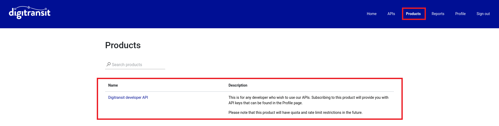

## Digitransit API portal
The use of the Digitransit production APIs ([api.digitransit.fi](https://api.digitransit.fi), [cdn.digitransit.fi](https://cdn.digitransit.fi) and [digitransit-prod-cdn-origin.azureedge.net](https://digitransit-prod-cdn-origin.azureedge.net)) requires registration and use of API keys. Registration can be done at the [Digitransit API portal](https://portal-api.digitransit.fi/). After the registration, it is possible to create subscriptions to a product. API keys related to the subscriptions will be available at the API portal.

## Acquiring API keys
API keys are acquired from [the API portal](https://portal-api.digitransit.fi) or [the development API portal](https://portal-dev-api.digitransit.fi), depending on whether you want to use production APIs or development APIs. You need to be logged in to manage your API keys, so either sign in or sign up from the top right corner. **NOTE**: If you're signing up, the email that you enter will be used in initial authentication, so make sure to select an email that you have access to. After this you will be prompted to select a two-factor authentication method, which will either be a code sent to your email or using a verification app. Two-factor authentication will be used on future logins, so make sure you follow the instructions given when selecting your preferred authentication method.

After logging in, APIs that are available for you to subscribe to are visible under the "Products" tab.

After clicking an API product, you will be able to subscribe to it. When clicking the subscribe button, you will be prompted to answer a brief questionnaire.

After subscription, you can find the key under the "Profile" tab. Click "Show" to reveal the key. A subscription also contains a secondary key so that it's possible to regenerate a key while the primary key is in use or vice versa. There is an option to regenerate a key next to the "Show" button.

## Use of API keys
An API key can be included either as a URL parameter or as a header. The parameter and the header name are both `digitransit-subscription-key` and the value should be the key. The API keys should not be attached to requests going to [the deprecated APIs](../deprecations).

## Deprecations
We have deprecated and removed some old API endpoints that are no longer needed. The list of these deprecations can be found [here](../deprecations). We will update that page and inform users via email in the future when there are any new deprecations or removals.

## Quota and rate limiting
Starting 31.1.2024, we will enforce rate and quota limiting. The limits should only restrict misuse of the APIs, not normal use.
