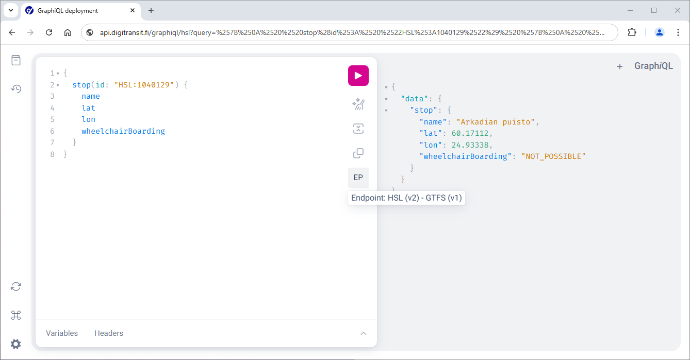
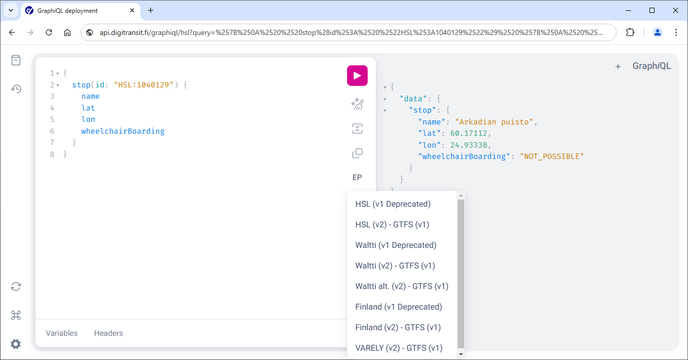
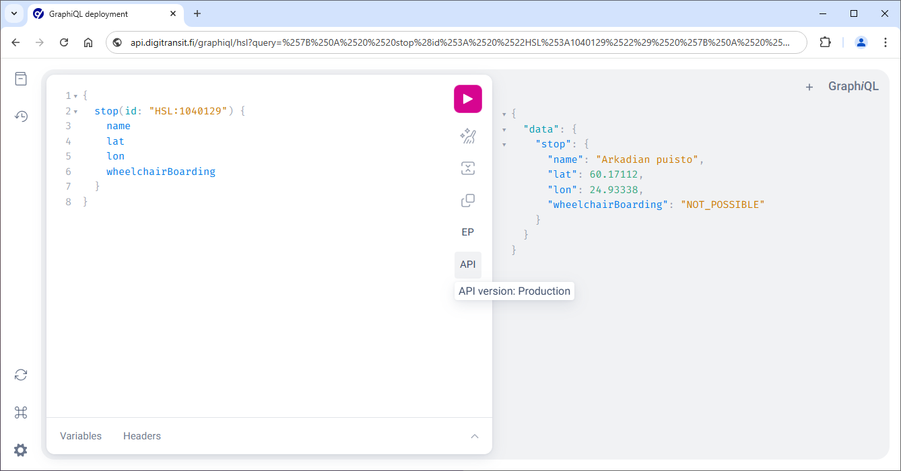
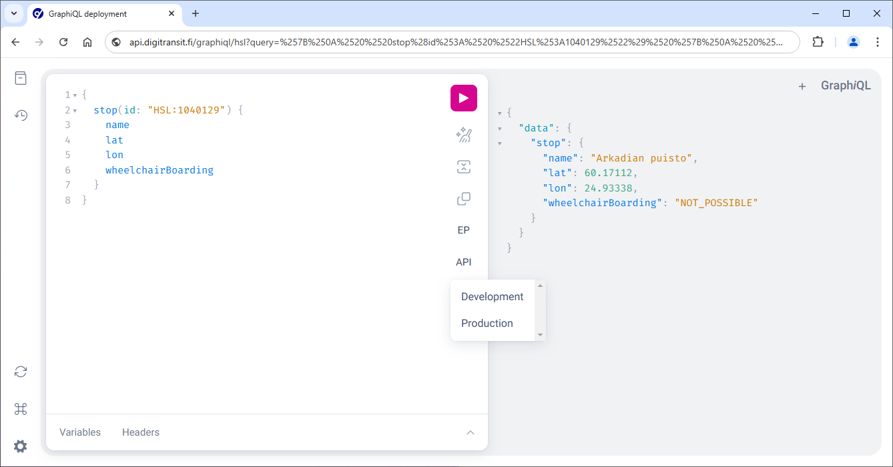

## Making queries and exploring the schema using GraphiQL

**It is highly recommended to use GraphiQL when familiarizing yourself with the Routing API.**

[GraphiQL](https://github.com/graphql/graphiql) is a simple UI for making queries. You can use it both to run queries and to explore the GraphQL schema.

**Note:** Queries, parameters, and fields should have at least some description available and you can use the documentation explorer to familiarize yourself with the schema. You can find more details about that under [Reading schema docs](#reading-schema-docs).

### There are a few options for using GraphiQL:

1. Using our hosted browser versions for the five available regions. The browser versions have the correct endpoints configured already.
   * [Helsinki region](https://api.digitransit.fi/graphiql/hsl/v2/gtfs/v1)
   * [Waltti regions](https://api.digitransit.fi/graphiql/waltti/v2/gtfs/v1)
   * [Waltti-Opas regions](https://api.digitransit.fi/graphiql/waltti-alt/v2/gtfs/v1)
   * [Seutu+ regions](https://api.digitransit.fi/graphiql/varely/v2/gtfs/v1)
   * [Entire Finland](https://api.digitransit.fi/graphiql/finland/v2/gtfs/v1)
2. A browser extension like [ChromeiQL](https://chrome.google.com/webstore/detail/chromeiql/fkkiamalmpiidkljmicmjfbieiclmeij) (see regional endpoints below)
3. For Mac OSX you can use [the desktop GraphiQL app](https://github.com/skevy/graphiql-app) (see regional endpoints below)

All options work similarly and their UI looks more or less like this (our browser version with the [Helsinki region](https://api.digitransit.fi/graphiql/hsl/v2/gtfs/v1) endpoint was used in the example below):


## Execute your first query

1. If you are using the GraphiQL app or a browser extension, set the GraphQL Endpoint to one of the following:

| Region              | Endpoint                                                                 |
|---------------------|--------------------------------------------------------------------------|
| Helsinki region     | `https://api.digitransit.fi/routing/v2/hsl/gtfs/v1`        |
| Waltti regions      | `https://api.digitransit.fi/routing/v2/waltti/gtfs/v1`     |
| Waltti-Opas region  | `https://api.digitransit.fi/routing/v2/waltti-alt/gtfs/v1` |
| Seutu+ region       | `https://api.digitransit.fi/routing/v2/varely/gtfs/v1`     |
| Entire Finland      | `https://api.digitransit.fi/routing/v2/finland/gtfs/v1`    |

2. Click [this link](https://api.digitransit.fi/graphiql/hsl/v2/gtfs/v1?query=%7B%0A%20%20stop(id%3A%20%22HSL%3A1040129%22)%20%7B%0A%20%20%20%20name%0A%20%20%20%20lat%0A%20%20%20%20lon%0A%20%20%20%20wheelchairBoarding%0A%20%20%7D%0A%7D) to run the query below in GraphiQL.

```graphql
{
  stop(id: "HSL:1040129") {
    name
    lat
    lon
    wheelchairBoarding
  }
}
```

3. Press play in GraphiQL to execute the query.

4. You should get results like below:

```json
{
  "data": {
    "stop": {
      "name": "Arkadian puisto",
      "lat": 60.17112,
      "lon": 24.93338,
      "wheelchairBoarding": "NOT_POSSIBLE"
    }
  }
}
```
**Note:** If the example provided does not return what is expected then the stop id used in step 2 may not be in use any more and you should try again with an existing id.

## Changing the endpoint or API type

When using the browser version, the endpoint currently in use can be viewed by hovering over the **EP** icon.



The endpoint can be changed by clicking the **EP** icon. A menu with endpoint options opens up.



The API type currently in use can be viewed by hovering over the **API** icon.



The API type can be changed by clicking the **API** icon. A menu with API type options opens up.



## Exploring the schema with GraphiQL

GraphiQL is schema aware. This means that you can invoke autocomplete by Ctrl-space. The tool then shows available options for your query.


## Reading schema docs

By clicking the documentation icon in the upper left corner of GraphiQL you can open the **Documentation Explorer**. Then, clicking **query: QueryType** will open up a list of all available top level queries.


From here you can check e.g. **alerts**, which describes what can be queried using that top level. It says "Get all active alerts".


Let's try to query alerts:

1. Close the docs

2. Click [this link](https://api.digitransit.fi/graphiql/hsl/v2/gtfs/v1?query=%7B%0A%20%20alerts%20%7B%0A%20%20%20%20alertDescriptionText%0A%20%20%7D%0A%7D) to run the query below in GraphiQL.

```graphql
{
  alerts {
    alertDescriptionText
  }
}
```

3. Press play in GraphiQL to execute the query. Depending on the current traffic situation, you might get information about one or more ongoing disruptions.


