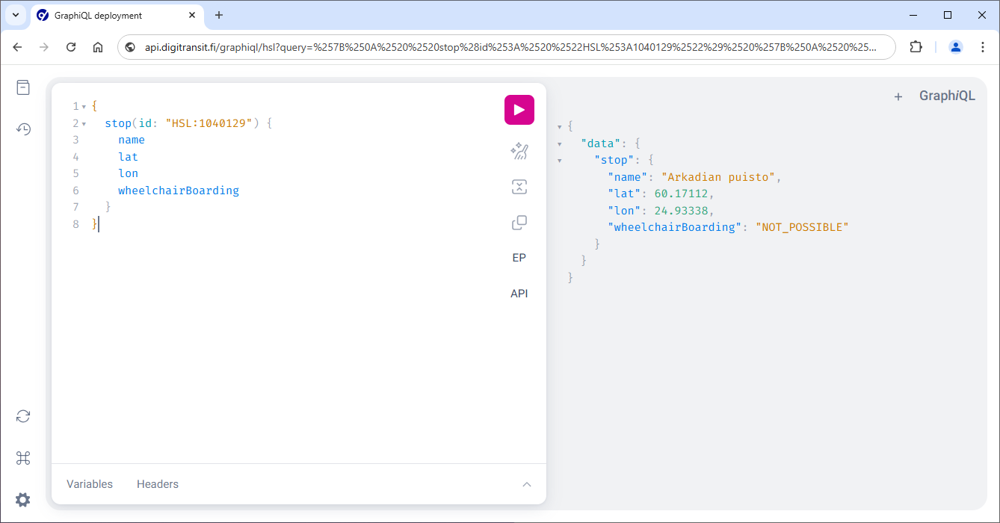

## Making queries and exploring the schema using GraphiQL

**It is highly recommended to use GraphiQL when familiarizing yourself with the Routing API.**

[GraphiQL](https://github.com/graphql/graphiql) is a simple UI for making queries. You can use it both to run queries and to explore the GraphQL schema.

**Note:** All top level queries should have at least some description available and you can use the documentation explorer to familiarize yourself with the schema. You can find more details about that under [Reading schema docs](#reading-schema-docs).

### There are a few options for using GraphiQL:

1. Using our hosted browser versions for the three available regions. The browser versions have the correct endpoints configured already.
   * [Helsinki region](https://api.digitransit.fi/graphiql/hsl)
   * [Waltti regions](https://api.digitransit.fi/graphiql/waltti)
   * [Entire Finland](https://api.digitransit.fi/graphiql/finland)
2. A browser extension like [ChromeiQL](https://chrome.google.com/webstore/detail/chromeiql/fkkiamalmpiidkljmicmjfbieiclmeij) (see regional endpoints below)
3. For Mac OSX you can use [the desktop GraphiQL app](https://github.com/skevy/graphiql-app) (see regional endpoints below)

All options work similarly and their UI looks more or less like this (ChromeiQL extension has been used in the example below):



## Execute your first query

1. If you are using the GraphiQL app or a browser extension, set the GraphQL Endpoint to one of the following:

| Region          | Endpoint                                                             |
|-----------------|----------------------------------------------------------------------|
| Helsinki region | `https://api.digitransit.fi/routing/v2/routers/hsl/index/graphql`     |
| Waltti regions  | `https://api.digitransit.fi/routing/v2/routers/waltti/index/graphql`  |
| Entire Finland  | `https://api.digitransit.fi/routing/v2/routers/finland/index/graphql` |

2. Click [this link](https://api.digitransit.fi/graphiql/hsl?query=%7B%0A%20%20stop(id%3A%20%22HSL%3A1040129%22)%20%7B%0A%20%20%20%20name%0A%20%20%20%20lat%0A%20%20%20%20lon%0A%20%20%20%20wheelchairBoarding%0A%20%20%7D%0A%7D) to run the query below in GraphiQL.

```graphql
{
  stop(id: "HSL:1040129") {
    name
    lat
    lon
    wheelchairBoarding
  }
}
```

3. Press play in GraphiQL to execute the query.

4. You should get results like below:

```json
{
  "data": {
    "stop": {
      "name": "Arkadian puisto",
      "lat": 60.17112,
      "lon": 24.93338,
      "wheelchairBoarding": "NOT_POSSIBLE"
    }
  }
}
```
**Note:** If the example provided does not return what is expected then the stop id used in step 2 may not be in use any more and you should try again with an existing id.

## Exploring schema with GraphiQL

GraphiQL is schema aware. This means that you can invoke autocomplete by Ctrl-space. The tool then shows available options for your query.


## Reading schema docs

By clicking **< Docs** in the upper right corner of GraphiQL, you can open the **Documentation Explorer**. Then, clicking **query: QueryType** will open up a list of all available top level queries.


From here you can check e.g. **alerts**, which describes what can be queried using that top level. It says "Get all alerts active in the graph".


Let's try to query alerts:

1. Close the docs

2. Click [this link](https://api.digitransit.fi/graphiql/hsl?query=%7B%0A%20%20alerts%20%7B%0A%20%20%20%20alertDescriptionText%0A%20%20%7D%0A%7D) to run the query below in GraphiQL.

```graphql
{
  alerts {
    alertDescriptionText
  }
}
```

3. Press play in GraphiQL to execute the query. Depending on the current traffic situation, you might get information about one or more ongoing disruptions.


