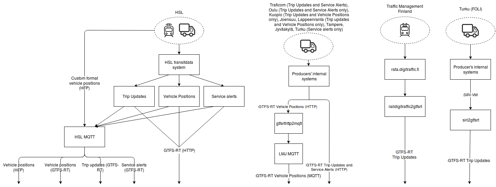

## About the API
Heavy lifting of real-time data is done in other systems. Digitransit integrates itself to various datasources in order to read real-time data from the vehicles. How this is done depends on which region we are talking about.

[Full size image (SVG)](./architecture.svg) (or click the image for full size PNG)

## Related links

| URL                                                   | Project description                                          |
| ----------------------------------------------------- | ------------------------------------------------------------ |
| https://github.com/HSLdevcom/transitdata              | Processes HSL realtime data with Apache Pulsar. Produces GTFS-RT messages from internal data formats. 
| https://github.com/HSLdevcom/siri2gtfsrt              | Convert SIRI JSON to GTFS-RT trip updates                    |
| https://github.com/HSLdevcom/raildigitraffic2gtfsrt   | Converts digitraffic train updates into GTFS-RT Trip Updates |
| https://github.com/HSLdevcom/gtfsrthttp2mqtt          | Reads GTFS-RT over HTTP and publishes it as MQTT data        |
| https://gtfs.org/                                     | GTFS transit community                                       |
| https://groups.google.com/forum/#!forum/gtfs-realtime | GTFS-realtime forum                                          |
