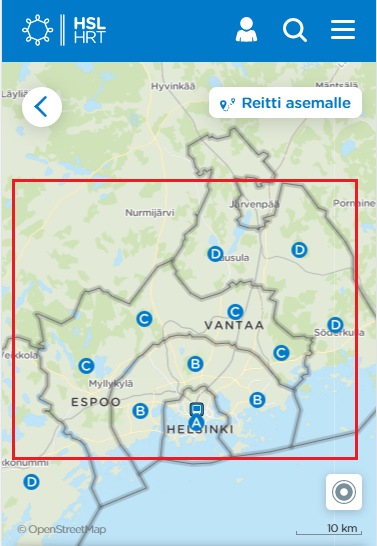

## Liittymisprosessi

Toimita alla kuvatut tiedot digitransit@hsl.fi osoitteeseen.


### 1. Sovi yhteistyöstä LMJ Oy:n kanssa

Sovi käyttöönotosta LMJ Oy:n kanssa.


### 2. Nimeä organisaatiosi palveluvastaava

Nimeä organisaatiostasi palveluvastaava. Hän vastaa Digitransit-palveluun liittyvästä operatiivisesta kommunikoinnista ja on kontaktoimamme henkilö ongelmatilanteissa.


### 3. Ilmoita palveluvastaavan yhteystiedot

Ilmoita palveluvastaavan:
- Nimi
- Sähköposti
- Puhelinnumero


### 4. Domain nimi

Liikenne Digitransit-palveluun on aina https-salattu. Voit valita vapaasti palvelusi domain-nimen (esim. https://reittiopas.kaupunki.fi), jolloin tarvitsemme TLS-sertifikaatin, joka sinun tulee hankkia. Voit myös käyttää https://kaupunki.digitransit.fi -osoitetta, jolloin erillistä sertifikaattia ei tarvita. Kuvaa/toimita:
- Domain Nimi
- TLS sertifikaatti, mikäli haluat oman domain nimen


### 5. Reittidata

Digitransit-palvelu integroi reittidatasi GTFS-muodossa. Tiedot on mahdollista myös noutaa Waltti-järjestelmästä. Kuvaa:
- Web palvelun osoite, josta GTFS-paketti on saatavilla

Varmista, että GTFS-paketin data on kunnossa käyttämällä esimerikiksi Googlen GTFS-validaattoria:

- Lataa GTFS
- Lataa https://github.com/google/transitfeed/releases/latest ja pura
- Mene validaattorin kansioon ja aja `./feedvalidator.py -m <gtfs.zipin polku>`

**Huom: Waltti ei toistaiseksi käsittele reittien geometriaa ja siksi Waltista haetut reitit esitetään Digitransitissa tikkuverkkona.**


### 6. Kulkumuodot


Määritä reittidatastasi löytyvät kulkumuodot. Valittujen kulkumuotojen perusteella käyttäjä voi rajata liikennetarjontaa. Kuvaa kullekin seuraavista kulkumuodoista onko sille tarvetta:
- Bussi
- Juna
- Metro
- Raitiovaunu
- Lentokone
- Lautta
- Kaupunkipyörä


### 7. Hakualue



Määritä kartalta rajat osoitehaulle. Digitransit-palveluun konfiguroidaan suorakaiteen muotoinen alue, jonka sisältä käyttäjän syöttämiä osoitteita etsitään. Kuvaa:
- Piste vasemmaksi yläreunaksi WGS84 koordinaatteina
- Piste oikeaksi alareunaksi WGS84 koordinaatteina


### 8. Oletuspaikat


Digitransit-käyttöliittymä yrittää aina paikantaa käyttäjän. Mikäli paikannus ei onnistu, valitaan lähtöpaikaksi määrittelemäsi piste. Kuvaa:
- Oletuslähtöpisteen koordinaatit (WGS84) ja kyseisen paikan nimi. Esimerkki: "Kauppatori, Lahti, 60.983595, 25.656391".

Lisäksi käyttöliittymä tarjoaa valmiita paikkoja reittihakuun. Määrittele:
- Kolme merkittävää/suosittua paikkaa koordinaatteineen. Yksi näistä voi olla sama kuin yllä määritelty oletussijainti.


### 9. Teemoitus


Digitransit-käyttöliittymä on muokattavissa logon ja värimaailman osalta. Kuvaa/lähetä:
- Haluamasi teemaväri, jota käytetään esimerkiksi etusivun otsikkopalkissa, ja muut väreihin liittyvät teemoitustoiveet. Voit myös lähettää linkin tyylioppaaseesi
tai web-osoitteeseen, josta värimaailma tulisi kopioida.
- Organisaatiosi logo, joka sijoitetaan otsikkopalkin vasempaan reunaan. Logon taustavärin tulee siis sopia valittuun teemaväriin, tai sitten taustavärin tulee
olla läpinäkyvä (esim. png-kuva läpinäkyvyyskanavalla). Koska tila on rajattu korkeussuunnassa noin 60 kuvapisteeseen, mahdollisten tekstielementtien kirjasinkokoa
tulee harkita huolella, jotta teksti säilyy luettavana. Tarvittaessa lähetä kuvalogo ilman tekstiä. Logon sijasta voit myös määritellä pelkän otsikkotekstin.
- Favicon-kuva, jota käytetään suosikkilinkeissä, selaimen välilehdissä jne. Tämä logoversio näytetään usein hyvin pienessä koossa, joten sen pitää olla selkeä.
Huomaa, että favicon näkyy selaimen eikä reittioppaan kontekstissa, joten vaalea logo läpinäkyvällä taustavärillä ei käy. Tarvittaessa vaihda läpinäkyvä tausta
riittävän kontrastin antavaan väriin. Mikäli näiden ohjeiden valossa otsikkologo sisältää sopivan favicon-osan, erillistä favicon-kuvaa ei tarvitse lähettää.
- Sivustojen nimi, jota käytetään mm. selainten suosikkilinkeissä. Esimerkiksi "X-Kaupungin Reittiopas".
- Voit halutessasi lähettää aloitusnäytön taustakarttakuvan. Tämä taustakuva näkyy sumennettuna esimerkiksi kysyttäessä lupaa käyttäjän paikannukseen.

**Huom! Värimaailma, logo ja tekstit toteutetaan niiltä osin kuin se on mahdollista. Tämä voi tarkoittaa, ettei toiveitasi pystytä kaikilta osin täyttämään.**


### 10. Linkit

Kuvaa seuraavat linkit:
- Etusivun yläpalkin linkki vaikkapa kaupungin tai kaupungin liikennelaitoksen sivuille. Esimerkki: Hämeenlinna, http://www.hameenlinna.fi/joukkoliikenne/.
- "Anna palautetta" -linkin kohdesivu. Mikäli palautesivun osoitetta ei määritellä, linkkiä ei näytetä eikä palautteita kerätä.


### 11. Tietoja palvelusta


Kuvaa Tietoja palvelusta sivun tiedot:
- Kuvaus suomeksi
- Kuvaus ruotsiksi
- Kuvaus englanniksi

Esimerkin vuoksi, HSL:n tietoja palvelusta:

Tervetuloa Reittioppaaseen! Reittiopas kertoo, miten pääset nopeasti ja helposti perille joukkoliikenteellä Helsingissä, Espoossa, Vantaalla, Kauniaisissa,
Keravalla, Kirkkonummella ja Sipoossa. Reittiopas etsii nopeat reitit myös kävelyyn ja pyöräilyyn sekä rajatusti myös yksityisautoiluun.
Reittiopas-palvelun tarjoaa HSL Helsingin seudun liikenne, ja se perustuu Digitransit-palvelualustaan.

Digitransit-palvelualusta on HSL:n ja Liikenneviraston kehittämä avoimen lähdekoodin reititystuote.

Kartat, tiedot kaduista, rakennuksista, pysäkkien sijainnista ynnä muusta tarjoaa © OpenStreetMap contributors. Osoitetiedot tuodaan Väestörekisterikeskuksen
rakennustietorekisteristä. Joukkoliikenteen reitit ja aikataulut perustuvat HSL:n JORE-aineistoon.


### 12. Sosiaalinen media

Sosiaalisen median jakoja varten ilmoita:
- Twitter tili


### 13. Kartta- ja osoiteaineistot

Digitransit kartta-aineistona on OpenStreetMap. Reitityksen katuverkko, taustakartta ja osoitehaun POI-kohteet (Point of Interest) ladataan OpenStreetMapista automaattisesti.
Palvelun toiminta kuntasi alueella on riippuvainen OpenStreetMap-datan laadusta.

Suosittelemme kartta-aineiston suhteen seuraavaa:
1. Avaa ensin Digitransit-palvelu
2. Kokeile miten se toimii alueellasi
3. Täydennä OpenStreetMap-tietoja tarvittavilta osin

OpenStreetMap-ohjeet: http://wiki.openstreetmap.org/wiki/Beginners%27_guide

Digitransit löytää kohteita seuraavista luokista:

- addr:housenumber AND addr:street
- aerialway
- aeroway
- amenity
- building
- craft
- cuisine
- historic
- landuse
- leisure
- man_made
- military
- natural
- office
- public_transport
- railway
- shop
- sport
- tourism
- waterway

Mikäli lisäät kohteita OpenStreetMapiin, muista lisätä myös ruotsinkielinen selite:

```
  {
      "id":26430225,
      "type":"node",
      "lat":60.2070123, "lon":24.7022998,
      "tags":{
          "name":"Koivuhovi",
          "name:sv":"Björkgård",
          "railway:station"
      }
  }
```

Osoitehaussa käytetään OpenStreetMapin lisäksi Väestörekisterikeskuksen rakennustietokantaa, joka sisältää rakennusten osoitteet koko suomessa.

**Huom! Digitransit-palvelu ei ylläpidä OpenStreetMapin tietoja, vastuu tästä on yhteisöllä.**

### 14. Reaaliaikarajapinta

Digitransit alusta tukee reaaliaikaisia ajoneuvojen sijainteja, pysäkkiennusteita sekä poikkeustiedotteita. Kuvaa:
- Reaaliaikarajapinnan osoite

**Huom! Ominaisuus on saatavilla vain erikseen sopimalla**.
