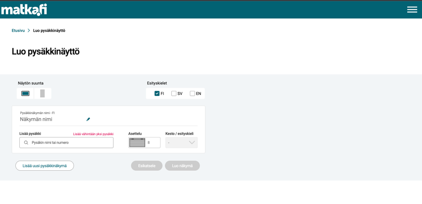
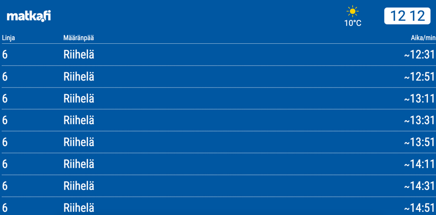

### Domain-nimi

Voit valita domain-nimesi vapaasti, tai käyttää `palvelu`.digitransit.fi päätteistä osoitetta. Mikäli haluat käyttää `palvelu`.digitransit.fi osoitetta, sinun ei tarvitse tehdä muuta kuin toimittaa meille haluamasi osoitteen. esim: `https://kaupunkinaytot.digitransit.fi`

Mikäli haluat käyttää omaa domainia, niin toimita meille seuraavat asiat:

* Domain-nimi
* TLS sertifikaatti, mikäli haluat käyttää omaa domain-nimeä.
  * DNS ohjaus meidän palveluun:  esim. pysakit.kaupunki.fi  osoittamaan CNAME http://digitransit-prod.trafficmanager.net
  * Lisäksi tarvitsette TXT muotoisen recordin. Tarkemmat ohjeet saatte pyytämällä meiltä lisätietoja.
* Subdomainit eivät ole mahdollisia.

### Teemoitus

Pysäkkinäyttösovelluksen ulkoasua on mahdollista teemoittaa värityksen, fonttien ja organisaation logojen osalta:

* Teemaväri, jota käytetään esimerkiksi näyttöjen luontinäkymän yläpalkissa sekä ikoneissa ja joidenkin käyttöliittymäelementtien fontin värinä.

* Pysäkkinäyttöjen taustan väri. Tässä voidaan käyttää myös samaa väriä kuin teemaväri.
  * Lähtöjen tiedot näytetään valitsemasi värin päällä valkoisella fontilla.

  

* Organisaatiosi logo, joka näytetään sekä näyttöjen luontinäkymän yläpalkissa että itse näyttöjen yläpalkissa. Logon tulisi siis sopia yhteen kummankin yllä kuvatun värin kanssa. Logon tiedostoformaatti on SVG-kuva.
* Favicon-kuva, jota käytetään suosikkilinkeissä, selaimen välilehdissä jne. Tämä logoversio näytetään usein hyvin pienessä koossa, joten sen pitää olla selkeä.
* Fontit, joita palvelussa käytetään. Näyttöjen luontinäkymiin ja itse näyttöihin voidaan määritellä eri fontit.
* Pysäkkinäytöillä esitetään häiriötiedoitteita näyttöihin lisättyihin pysäkkeihin liittyen. Näiden tiedotteiden esitystavan voi konfiguroida johonkin seuraavista vaihtoehdoista:
  * Staattinen. Koko tiedote näytetään kerralla.
  * Vasemmalta oikealle skrollaava. Tiedotteet animoidaan vasemmalta oikealle, jolloin niissä voidaan käyttää suurempaa kirjaisinkokoa, mutta koko tiedotetta ei voi nähdä kerralla.
  * Alhaalta ylös skrollaava. Tiedotteet animoidaan alhaalta ylös.