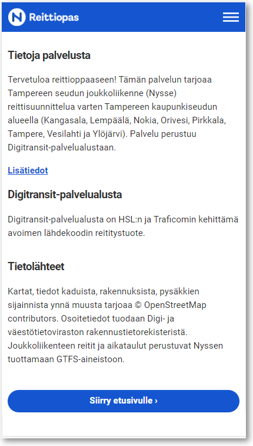

### 1. Domain nimi

Liikenne Digitransit-palveluun on aina https-salattu. Voit valita vapaasti palvelusi domain-nimen (esim. https://reittiopas.kaupunki.fi), jolloin tarvitsemme TLS-sertifikaatin, joka sinun tulee hankkia. Voit myös käyttää https://kaupunki.digitransit.fi -osoitetta, jolloin erillistä sertifikaattia ei tarvita. Kuvaa/toimita:
- Domain Nimi
- TLS sertifikaatti, mikäli haluat oman domain nimen


### 2. Reittidata

Digitransit-palvelu integroi reittidatasi GTFS-muodossa. Tiedot on mahdollista myös noutaa Waltti-järjestelmästä. Kuvaa:
- Web palvelun osoite, josta GTFS-paketti on saatavilla

Varmista, että GTFS-paketin data on kunnossa käyttämällä esimerikiksi Googlen GTFS-validaattoria:

- Lataa GTFS
- Lataa https://github.com/google/transitfeed/releases/latest ja pura
- Mene validaattorin kansioon ja aja `./feedvalidator.py -m <gtfs.zipin polku>`


### 3. Kulkumuodot


Määritä reittidatastasi löytyvät kulkumuodot. Valittujen kulkumuotojen perusteella käyttäjä voi rajata liikennetarjontaa. Kuvaa kullekin seuraavista kulkumuodoista onko sille tarvetta:
- Bussi
- Juna
- Metro
- Raitiovaunu
- Lentokone
- Lautta
- Kaupunkipyörä


### 4. Hakualue


Määritä kartalta rajat osoitehaulle. Digitransit-palveluun konfiguroidaan suorakaiteen muotoinen alue, jonka sisältä käyttäjän syöttämiä osoitteita etsitään. Kuvaa:
- Piste vasemmaksi yläreunaksi WGS84 koordinaatteina
- Piste oikeaksi alareunaksi WGS84 koordinaatteina


Voit myös määrittää hakualueen monikulmiona. Jotta haussa siirretty tietomäärä pysyisi kompaktina,
suositeltu monikulmion pistemäärä on alle 50 pistettä, ja koordinaattien tarkkuus enintään 5 desimaalia.


### 5. Oletuspaikat

Digitransit-käyttöliittymä yrittää aina paikantaa käyttäjän. Mikäli paikannus ei onnistu, valitaan joissain näkymissä viitepaikaksi määrittelemäsi piste. Kuvaa:
- Oletuspaikan koordinaatit (WGS84) ja kyseisen paikan nimi. Esimerkki: "Kauppatori, Lahti, 60.983595, 25.656391".

### 6. Teemoitus

Digitransit-käyttöliittymä on muokattavissa logon ja värimaailman osalta. Kuvaa/lähetä:
- Haluamasi teemaväri, jota käytetään esimerkiksi etusivun otsikkopalkissa, ja muut väreihin liittyvät teemoitustoiveet. Voit myös lähettää linkin tyylioppaaseesi
tai web-osoitteeseen, josta värimaailma tulisi kopioida.
- Organisaatiosi logo, joka sijoitetaan otsikkopalkin vasempaan reunaan. Logon taustavärin tulee siis sopia valittuun teemaväriin, tai sitten taustavärin tulee
olla läpinäkyvä (esim. png-kuva läpinäkyvyyskanavalla). Koska tila on rajattu korkeussuunnassa noin 60 kuvapisteeseen, mahdollisten tekstielementtien kirjasinkokoa
tulee harkita huolella, jotta teksti säilyy luettavana. Tarvittaessa lähetä kuvalogo ilman tekstiä. Logon sijasta voit myös määritellä pelkän otsikkotekstin.
- Logosta kannattaa toimittaa myös toinen versio, joka soveltuu käytettäväksi upotettavassa hakuelementissä (esimerkki: https://reittiopas.hsl.fi/haku). Tämä logo
tulostetaan valkoiselle taustalle ja tilaa on käytettävissä vielä vähemmän kuin yläpalkissa, joten pieniä yksityiskohtia kuten tekstiä kannattaa välttää.
- Favicon-kuva, jota käytetään suosikkilinkeissä, selaimen välilehdissä jne. Tämä logoversio näytetään usein hyvin pienessä koossa, joten sen pitää olla selkeä.
Huomaa, että favicon näkyy selaimen eikä reittioppaan kontekstissa, joten vaalea logo läpinäkyvällä taustavärillä ei käy. Tarvittaessa vaihda läpinäkyvä tausta
riittävän kontrastin antavaan väriin. Mikäli näiden ohjeiden valossa otsikkologo sisältää sopivan favicon-osan, erillistä favicon-kuvaa ei tarvitse lähettää.
- Sivustojen nimi, jota käytetään mm. selainten suosikkilinkeissä. Esimerkiksi "X-Kaupungin Reittiopas".

**Huom! Värimaailma, logo ja tekstit toteutetaan niiltä osin kuin se on mahdollista. Tämä voi tarkoittaa, ettei toiveitasi pystytä kaikilta osin täyttämään.**


### 7. Linkit

Kuvaa seuraavat linkit:
- Etusivun yläpalkin linkki vaikkapa kaupungin tai kaupungin liikennelaitoksen sivuille. Esimerkki: Hämeenlinna, http://www.hameenlinna.fi/joukkoliikenne/.
- "Anna palautetta" -linkin kohdesivu. Mikäli palautesivun osoitetta ei määritellä, linkkiä ei näytetä eikä palautteita kerätä.


### 8. Tietoja palvelusta



Kuvaa Tietoja palvelusta sivun tiedot:
- Kuvaus suomeksi
- Kuvaus ruotsiksi
- Kuvaus englanniksi

Esimerkin vuoksi, HSL:n tietoja palvelusta:

Tervetuloa Reittioppaaseen! Reittiopas kertoo, miten pääset nopeasti ja helposti perille joukkoliikenteellä Helsingissä, Espoossa, Vantaalla, Kauniaisissa,
Keravalla, Kirkkonummella ja Sipoossa. Reittiopas etsii nopeat reitit myös kävelyyn ja pyöräilyyn sekä rajatusti myös yksityisautoiluun.
Reittiopas-palvelun tarjoaa HSL Helsingin seudun liikenne, ja se perustuu Digitransit-palvelualustaan.

Digitransit-palvelualusta on HSL:n ja Fintrafficin kehittämä avoimen lähdekoodin reititystuote.

Kartat, tiedot kaduista, rakennuksista, pysäkkien sijainnista ynnä muusta tarjoaa © OpenStreetMap contributors. Osoitetiedot tuodaan
Digi- ja väestötietoviraston rakennustietorekisteristä. Joukkoliikenteen reitit ja aikataulut perustuvat HSL:n JORE-aineistoon.


### 9. Sosiaalinen media

Sosiaalisen median jakoja varten ilmoita:
- Twitter tili


### 10. Kartta- ja osoiteaineistot

Digitransit kartta-aineistona on OpenStreetMap. Reitityksen katuverkko, taustakartta ja osoitehaun POI-kohteet (Point of Interest) ladataan OpenStreetMapista automaattisesti.
Palvelun toiminta kuntasi alueella on riippuvainen OpenStreetMap-datan laadusta.

Suosittelemme kartta-aineiston suhteen seuraavaa:
1. Avaa ensin Digitransit-palvelu
2. Kokeile miten se toimii alueellasi
3. Täydennä OpenStreetMap-tietoja tarvittavilta osin

OpenStreetMap-ohjeet: http://wiki.openstreetmap.org/wiki/Beginners%27_guide

Digitransit löytää kohteita seuraavista luokista:

- addr:housenumber AND addr:street
- aerialway
- aeroway
- amenity
- building
- craft
- cuisine
- highway
- historic
- landuse
- leisure
- man_made
- military
- natural
- office
- public_transport
- railway
- shop
- sport
- tourism
- waterway

Mikäli lisäät kohteita OpenStreetMapiin, muista lisätä myös ruotsinkielinen selite:

```json
  {
      "id":26430225,
      "type":"node",
      "lat":60.2070123, "lon":24.7022998,
      "tags":{
          "name":"Koivuhovi",
          "name:sv":"Björkgård",
          "railway":"station"
      }
  }
```

Osoitehaussa käytetään OpenStreetMapin lisäksi Digi- ja väestötietoviraston rakennustietokantaa, joka sisältää rakennusten osoitteet koko suomessa,
sekä maanmittauslaitoksen paikkatietoja.

**Huom! Digitransit-palvelu ei ylläpidä OpenStreetMapin tietoja, vastuu tästä on yhteisöllä.**

### 11. Reaaliaikarajapinta

Digitransit-alusta tukee GTFS-RT spesifikaation mukaisia reaaliaikaisia tietoja, kuten pysäkkiennusteita (trip updates), paikkatietoja (vehicle positions), poikkeustiedotteita (alerts) ja matkustajakapasiteettitietoa (paikkatiedoista). Mikäli rajapinta tarjoaa ajoneuvojen sijaintitietoja, ne voidaan esittää kartalla integroimalla GTFS-RT reaaliaikatiedot paikkatietoa tarjoavaan mqtt-palvelimeen. 

Matkustajakapasiteettitietoa hyödynnetään tällä hetkellä paikkatiedoista, mutta suosittelemme että matkustajakapasiteettitieto lisätään pysääkkiennusteisiin, johon voimme lisätä tuen.
Kuvaa:
- Reaaliaikarajapinnan osoite

**Huom! Reaaliaikaominaisuudet ovat saatavilla vain erikseen sopimalla**.

### 12. Lippuvyöhykkeet

Reittiopas tukee matkalipputietojen esittämistä käyttäjälle monella tavoin. Reittiehdotuksissa voidaan kertoa tarvittavan lipun tyyppi ja oletushinta,
mikäli GTFS-data sisältää tarvittavat hintasäännöt. Ehdotukset myös näyttävät lippuvyöhykkeen vaihtumisen pitkin matkaketjua. Taustakartalle voidaan piirtää
vyöhykkeiden aluerajat. Kun käyttäjä napauttaa karttaa, osoitetun paikan lippuvyöhyke on myös mahdollista kertoa avatulla ponnahdusikkunalla.

GTFS-datan fare rules ja fare attributes -spesifikaatiot löytyvät osoitteesta [gtfs.org/reference/static](https://gtfs.org/reference/static).
Jos datasta löytyy tarvittavat fare tiedot, niitä voi konfiguroida reittioppaaseen vastaamalla seuraaviin kysymyksiin:
- Näytetäänkö lippuvyöhykkeet reittiehdotuksissa (kohta 1. kuvassa alla)
- Näytetäänkö tarvittavat liput reittiehdotuksissa (2)
- Näytetäänkö lipun oletushinta reittiehdotuksissa (3)
- Onko olemassa Internet-osoite ohjesivuun, josta löytyy tietoa lippujen hinnoista ja ostamisesta (4)
- Miten GTFS fare -tiedoissa määritellyt lipputyypit esitetään käyttäjälle? Tekninen tunnus voi olla tarpeen muuttaa ihmisten tuntemaan muotoon.


Reittiehdotusten lisäksi lippuvyöhyketietoa voidaan esittää kartalla. Sitä varten tarvitaan geoJSON-muotoista dataa WGS84-koordinaatistossa.
On suositeltavaa käyttää mahdollisimman pientä pistemäärää (alle 1000 pistettä) ja desimaalitarkkuutta (5 desimaalia), jotta palvelu pysyy kevyenä ja nopeana.
Paras tulos saadaan, kun käytössä on kaksi hiukan erilaista dataversiota:

1. Aluetarkistusdata. Siinä lippuyöhykkeet on kuvattu suljettuina polygon tai multipolygon kohteina, yksi feature per lippuvyöhyke.
Kukin feature sisältää properties tiedoissa ominaisuuden 'Zone', jonka arvo on vyöhykkeen tunnus, esimerkiksi 'A'. Lisäksi vyöhykkeille määritellään vakioidut piirtotyylit
alla olevan mallin mukaisesti.

Esimerkki lippuvyöhykkeiden aluedatasta: [kuopio-zone-areas-20190508.json](https://raw.githubusercontent.com/HSLdevcom/pelias-api/master/middleware/config/kuopio_zone_areas_20201120.json)

2. Vyöhykkeiden visualisointi kartalle. Lippuvyöhykkeiden rajaviivat kuvataan linestring/multilinestring geometrioina ilman kaksinkertaista piirtoa alueiden välille.
Lisäksi tiedoston pitäisi sisältää kullekin vyöhykkeelle point tai multipoint feature, joissa määritellään vyöhyketunnusten paikat ja symbolien svg grafiikka kartalla. Esimerkki:

```json

   {
      "type": "Feature",
      "properties": {
         "id": "icon-zone-f",
         "svg": "<svg xmlns='http://www.w3.org/2000/svg' viewBox='0 0 36 36'>
                   <path d='M36 18A18 18 0 1118 0a18 18 0 0118 18' fill='#0ab1c8' fill-rule='evenodd'/>
                   <path d='M23.21 19h-6.75v7H13V9h11.06v2.8h-7.6v4.4h6.75z' fill='#fff'/>
                 </svg>"
        }
      },
      "geometry": {
        "type": "MultiPoint",
        "coordinates":  [
          [26.8068, 63.2194], [26.4574,62.97]
        ]
      }
    }
```

Yllä on F-vyöhykkeelle määritelty 2 tunnusta vyöhykkeen eri osiin. Vakio svg symbolit A, B ... I voi kopioida
[vyöhykedatan esimerkkitiedostosta](https://raw.githubusercontent.com/HSLdevcom/digitransit-ui/v2/static/assets/geojson/hml_zone_lines_20210222.geojson)
ja vaihtaa svg määrittelyhin oman reittioppaan teemavärin. Mikäli tarvitaan jokin muu symboli, sen voi tuottaa itse annetun mallin mukaisesti Roboto-fontilla,
tai vaihtoehtoisesti pyytää digitransit-kehitystiimiä lisäämään halutut svg elementit.

### 13. Näin saat päästötietosi mukaan reititykseen

Reittioppaaseen saa mukaan reittiehdotusten CO₂-päästölukemat pyytämällä päästöjen näyttämisen päällekytkennän ja toimittamalla reittien keskimääräiset CO₂-päästöarvot emissions.txt-tiedostossa osana GTFS-pakettia. Tiedosto ei ole GTFS-standardin mukainen vaan sen tulee seurata tässä annettuja ohjeita. Seuraavien sarakkeiden tulisi sisältyä emissions.txt-tiedostoon:

* **route\_id**: reitin id (sama kuin routes.txt-tiedostossa)

* **avg\_co2\_per\_vehicle\_per\_km**: Reittiä liikennöivän ajoneuvon keskimääräiset hiilidioksidipäästöt grammoina per kilometri kokonais- tai desimaalilukuna.

* **avg\_passenger\_count**: Reittiä liikennöivän ajoneuvon keskimääräinen matkustajamäärä kokonais- tai desimaalilukuna.

Esimerkki emissions.txt:
```
    route_id,avg_co2_per_vehicle_per_km,avg_passenger_count
    1001,123,20
    1002,123.4,20.0
    1003,0,0
```
